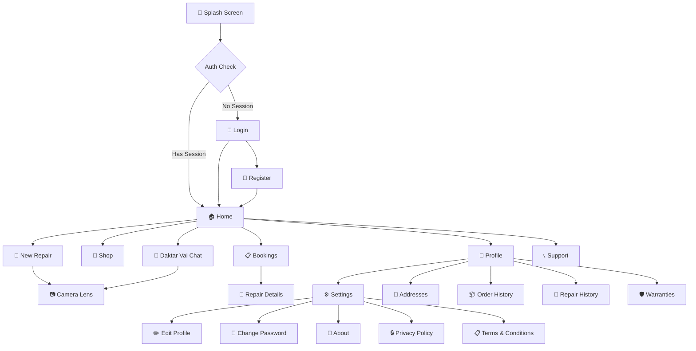

# 📱 TV ডাক্তার Native App - Visual Documentation

> **Version:** 2.4.1 | **Platform:** Android (Capacitor)  
> **Last Updated:** December 25, 2024

---

## App Overview

**TV ডাক্তার** (TV Doctor) is a native Android application for Promise Electronics that provides TV repair services and parts shopping. Built using Capacitor + React.

```
┌─────────────────────────────────────────────────────────────┐
│                    📱 TV ডাক্তার                             │
│                                                              │
│  Electronics repair service and AI-powered diagnostics app  │
│  for Bangladeshi customers                                  │
│                                                              │
│  ✓ Book repairs          ✓ AI diagnosis                     │
│  ✓ Shop parts            ✓ Track orders                     │
│  ✓ Chat with Daktar Vai  ✓ Camera lens analysis             │
└─────────────────────────────────────────────────────────────┘
```

---

## Screen Flow Diagram



---

## Screen Details

### 1. 🔄 Splash Screen

**Route:** `/native/splash`  
**File:** `Splash.tsx` (172 lines)

#### Visual Layout
```
┌─────────────────────────────────────────┐
│                                         │
│         ✨ Ambient Glow Effect ✨        │
│                                         │
│              ┌─────────┐                │
│              │  LOGO   │                │
│              │  🔧📺   │                │
│              └─────────┘                │
│                                         │
│              PROMISE                    │
│             Electronics                 │
│                                         │
│        ▓▓▓▓▓▓▓▓░░░░░░  45%             │
│         Connecting to server...         │
│                                         │
│           v2.4.1 (Native Build)         │
└─────────────────────────────────────────┘
```

#### Features
- **Background:** Dark slate (#0f172a) with ambient glow effects
- **Logo:** Circular container with Promise Electronics logo
- **Progress Bar:** Gradient animation (sky-500 → blue-500)
- **Status Messages:**
  - "Connecting to server..."
  - "Loading resources..."
  - "Preparing your experience..."
  - "Almost ready..."
- **Error State:** Retry button with connection error details
- **Auto-Navigation:**
  - If stored auth exists → `/native/home`
  - If no auth → `/native/login`

#### Transitions
- Entry: Fade in with scale animation
- Exit: Fade out to next screen

---

### 2. 🔐 Login Screen

**Route:** `/native/login`  
**File:** `Login.tsx` (223 lines)

#### Visual Layout
```
┌─────────────────────────────────────────┐
│  ←                                      │
│                                         │
│              ┌─────────┐                │
│              │  LOGO   │                │
│              │  🔧📺   │                │
│              └─────────┘                │
│    Sign in to access your repairs       │
│                                         │
│  📱 Mobile Number                       │
│  ┌─────────────────────────────────┐    │
│  │ +880  1XXXXXXXXX                │    │
│  └─────────────────────────────────┘    │
│                                         │
│  🔒 Password                            │
│  ┌─────────────────────────────────┐    │
│  │ ••••••••                        │    │
│  └─────────────────────────────────┘    │
│                                         │
│  ┌─────────────────────────────────┐    │
│  │           SIGN IN               │    │
│  └─────────────────────────────────┘    │
│                                         │
│  ─────────── OR ───────────             │
│                                         │
│  ┌─────────────────────────────────┐    │
│  │ 🔵 Continue with Google         │    │
│  └─────────────────────────────────┘    │
│                                         │
│   Don't have an account? Sign Up        │
└─────────────────────────────────────────┘
```

#### Features
- **Phone Input:** Prefix +880 (Bangladesh) + 10-digit field
- **Password Input:** Secure field with lock icon
- **Primary Button:** Vibrant green CTA
- **Google OAuth:** Native Google Sign-In via Capacitor plugin
- **Input Validation:** Numeric-only phone, 10 digits required
- **Loading States:** Spinner on buttons during API calls
- **Error Toasts:** Invalid credentials feedback

#### Colors
- Background: `--color-native-bg`
- Cards: `--color-native-card`
- Primary: `--color-native-primary` (green)
- Inputs: Pill-shaped, rounded-full

---

### 3. 📝 Register Screen

**Route:** `/native/register`  
**File:** `Register.tsx` (290 lines)

#### Visual Layout
```
┌─────────────────────────────────────────┐
│  ←                                      │
│                                         │
│           Create Account                │
│     Join us for easy repair booking     │
│                                         │
│  👤 Full Name                           │
│  ┌─────────────────────────────────┐    │
│  │ Your full name                  │    │
│  └─────────────────────────────────┘    │
│                                         │
│  📱 Mobile Number                       │
│  ┌─────────────────────────────────┐    │
│  │ +880  1XXXXXXXXX                │    │
│  └─────────────────────────────────┘    │
│                                         │
│  ✉️ Email (Optional)                    │
│  ┌─────────────────────────────────┐    │
│  │ your.email@example.com          │    │
│  └─────────────────────────────────┘    │
│                                         │
│  🔒 Password                            │
│  ┌─────────────────────────────────┐    │
│  │ Create a strong password        │    │
│  └─────────────────────────────────┘    │
│                                         │
│  ┌─────────────────────────────────┐    │
│  │         CREATE ACCOUNT          │    │
│  └─────────────────────────────────┘    │
│                                         │
│    Already have an account? Sign In     │
└─────────────────────────────────────────┘
```

---

### 4. 🏠 Home Screen

**Route:** `/native/home`  
**File:** `Home.tsx` (489 lines)

#### Visual Layout
```
┌─────────────────────────────────────────┐
│  👋 Hello, Shuvo      🔔 Notifications  │
│                                         │
│  ┌─────────────────────────────────┐    │
│  │ 🖼️ HERO BANNER                  │    │
│  │                                 │    │
│  │  🏷️ FAST SERVICE               │    │
│  │  Expert TV Repair Services      │    │
│  │  at Your Doorstep              │    │
│  │                                 │    │
│  │  [Book Now →]                   │    │
│  └─────────────────────────────────┘    │
│                                         │
│  Quick Actions                          │
│  ┌───────────────┐ ┌───────────────┐    │
│  │ 🔧            │ │ 🛒            │    │
│  │ New Repair    │ │ Buy Parts     │    │
│  │ Schedule      │ │ Shop          │    │
│  └───────────────┘ └───────────────┘    │
│  ┌───────────────┐ ┌───────────────┐    │
│  │ 📍            │ │ 🎧            │    │
│  │ Track Order   │ │ Help Center   │    │
│  │ Status        │ │ Chat with us  │    │
│  └───────────────┘ └───────────────┘    │
│  ┌─────────────────────────────────┐    │
│  │ 🤖 Daktar Vai - AI TV Doctor    │    │
│  └─────────────────────────────────┘    │
│                                         │
│  Current Repair                 Details │
│  ┌─────────────────────────────────┐    │
│  │ 📺 Samsung 55" LED             │    │
│  │ Model: UN55NU7100   In Progress │    │
│  │ #SRV-20241225-0001             │    │
│  │ Issue: No power                 │    │
│  │                                 │    │
│  │ ▓▓▓▓▓▓▓░░░░░  Repairing         │    │
│  └─────────────────────────────────┘    │
│                                         │
│  Our Services                           │
│  ┌────┐ ┌────┐ ┌────┐ ┌────┐ ┌────┐    │
│  │📺 │ │🔋 │ │🛡️ │ │🔊 │ │📺 │    │
│  │LED │ │Pwr │ │Brd │ │Snd │ │LCD │    │
│  └────┘ └────┘ └────┘ └────┘ └────┘    │
│═════════════════════════════════════════│
│  🏠      🛒       🔧       👤           │
│  Home    Shop   Repairs   Profile       │
└─────────────────────────────────────────┘
```

#### Features
- **Header:** Personalized greeting + notification bell with badge
- **Hero Banner:** Dynamic image from settings, gradient overlay
- **Quick Actions:** 2x2 grid + Daktar Vai full-width button
  - New Repair (Blue) → `/native/repair`
  - Buy Parts (Orange) → `/native/shop`
  - Track Order (Purple) → `/native/bookings`
  - Help Center (Green) → `/native/support`
  - Daktar Vai (Gradient) → `/native/chat`
- **Current Repair Card:** Live tracking status with progress bar
- **Services Carousel:** Horizontal scroll of service categories
- **Bottom Navigation:** Fixed, 4 tabs

#### Animations
- Cards: Spring animation on appearance (staggered)
- Pull-to-refresh: Native gesture with haptic feedback
- Active repair card: Pulse animation on status dot

---

### 5. 🔧 Repair Request (Multi-Step Wizard)

**Route:** `/native/repair`  
**File:** `RepairRequest.tsx` (810 lines)

#### Step 1: Device Selection
```
┌─────────────────────────────────────────┐
│  ←  New Repair Request     Step 1 of 5  │
│─────────────────────────────────────────│
│                                         │
│  📺 Select Device Type                  │
│                                         │
│  ┌─────────────────────────────────┐    │
│  │ 📺  LED/LCD TV                  │    │
│  └─────────────────────────────────┘    │
│  ┌─────────────────────────────────┐    │
│  │ 📻  CRT TV                      │    │
│  └─────────────────────────────────┘    │
│  ┌─────────────────────────────────┐    │
│  │ 📟  Monitor                     │    │
│  └─────────────────────────────────┘    │
│  ┌─────────────────────────────────┐    │
│  │ ⌨️  Other                       │    │
│  └─────────────────────────────────┘    │
│                                         │
│  ┌─────────────────────────────────┐    │
│  │           NEXT →                │    │
│  └─────────────────────────────────┘    │
└─────────────────────────────────────────┘
```

#### Step 2: Brand & Model
```
┌─────────────────────────────────────────┐
│  ←  New Repair Request     Step 2 of 5  │
│─────────────────────────────────────────│
│                                         │
│  🏭 Device Brand                        │
│  ┌─────────────────────────────────┐    │
│  │ Samsung                    ▼    │    │
│  └─────────────────────────────────┘    │
│                                         │
│  📝 Model Number                        │
│  ┌─────────────────────────────────┐    │
│  │ e.g., UA43AU7002                │    │
│  └─────────────────────────────────┘    │
│                                         │
│  📐 Screen Size                         │
│  ┌─────────────────────────────────┐    │
│  │ 43"                        ▼    │    │
│  └─────────────────────────────────┘    │
│                                         │
│  ← Back                       Next →    │
└─────────────────────────────────────────┘
```

#### Step 3: Issue Description
```
┌─────────────────────────────────────────┐
│  ←  New Repair Request     Step 3 of 5  │
│─────────────────────────────────────────│
│                                         │
│  ⚠️ Primary Issue                       │
│  ┌─────────────────────────────────┐    │
│  │ No Display                 ▼    │    │
│  └─────────────────────────────────┘    │
│                                         │
│  🔔 Symptoms (Select all that apply)    │
│  ┌───────────┐ ┌───────────┐            │
│  │ ✓ Blank   │ │   Lines   │            │
│  └───────────┘ └───────────┘            │
│  ┌───────────┐ ┌───────────┐            │
│  │   Sound   │ │   Flick.  │            │
│  └───────────┘ └───────────┘            │
│                                         │
│  📝 Additional Details                  │
│  ┌─────────────────────────────────┐    │
│  │ Describe the issue in detail... │    │
│  │                                 │    │
│  │                                 │    │
│  └─────────────────────────────────┘    │
│                                         │
│  ← Back                       Next →    │
└─────────────────────────────────────────┘
```

#### Step 4: Photo Upload + AI Analysis
```
┌─────────────────────────────────────────┐
│  ←  New Repair Request     Step 4 of 5  │
│─────────────────────────────────────────│
│                                         │
│  📷 Upload Photos of the Issue          │
│                                         │
│  ┌──────────┐ ┌──────────┐ ┌──────────┐ │
│  │   ➕     │ │  🖼️     │ │  🖼️     │ │
│  │  Add     │ │ IMG_001  │ │ IMG_002  │ │
│  │  Photo   │ │  ✓ 🤖    │ │          │ │
│  └──────────┘ └──────────┘ └──────────┘ │
│                                         │
│  ┌─────────────────────────────────┐    │
│  │ 🤖 AI Inspection Result         │    │
│  │ ─────────────────────────────── │    │
│  │ Damage: Panel crack visible     │    │
│  │ Component: LED backlight        │    │
│  │ Severity: Medium                │    │
│  │ Est. Cost: ৳2,500 - ৳4,000      │    │
│  └─────────────────────────────────┘    │
│                                         │
│  ← Back                       Next →    │
└─────────────────────────────────────────┘
```

#### Step 5: Service Mode & Contact
```
┌─────────────────────────────────────────┐
│  ←  New Repair Request     Step 5 of 5  │
│─────────────────────────────────────────│
│                                         │
│  🚛 How would you like repair service?  │
│                                         │
│  ┌─────────────────────────────────┐    │
│  │ 🏠 Home Pickup                  │    │
│  │   We pick up from your location │    │
│  │   ┌───────┐ ┌───────┐ ┌───────┐│    │
│  │   │ Basic │ │Premium│ │Express││    │
│  │   │ Free  │ │ ৳299  │ │ ৳499  ││    │
│  │   └───────┘ └───────┘ └───────┘│    │
│  └─────────────────────────────────┘    │
│                                         │
│  ┌─────────────────────────────────┐    │
│  │ 🏪 Drop at Service Center       │    │
│  │   Bring to our shop             │    │
│  └─────────────────────────────────┘    │
│                                         │
│  📍 Your Address                        │
│  ┌─────────────────────────────────┐    │
│  │ 123 Main Street, Dhaka          │    │
│  └─────────────────────────────────┘    │
│                                         │
│  ┌─────────────────────────────────┐    │
│  │       ✓ SUBMIT REQUEST          │    │
│  └─────────────────────────────────┘    │
└─────────────────────────────────────────┘
```

---

### 6. 🤖 Daktar Vai Chat

**Route:** `/native/chat`  
**File:** `ChatTab.tsx` (539 lines)

#### Visual Layout
```
┌─────────────────────────────────────────┐
│  ←  Daktar Vai               ⚙️ 📷      │
│─────────────────────────────────────────│
│                                         │
│  ┌──────────────────────────────────┐   │
│  │  🤖 Bot                    10:30 │   │
│  │  Hello! I'm Daktar Vai, your AI  │   │
│  │  TV doctor. How can I help you   │   │
│  │  today?                          │   │
│  │                                  │   │
│  │  [No Display] [No Sound] [Lines] │   │
│  └──────────────────────────────────┘   │
│                                         │
│                  ┌──────────────────┐   │
│                  │  👤 You   10:31  │   │
│                  │  My Samsung TV   │   │
│                  │  shows no picture│   │
│                  │  but sound works │   │
│                  └──────────────────┘   │
│                                         │
│  ┌──────────────────────────────────┐   │
│  │  🤖 Bot                    10:31 │   │
│  │  Based on your description, it   │   │
│  │  could be a backlight issue.     │   │
│  │                                  │   │
│  │  💡 Recommended Part:            │   │
│  │  ┌───────────────────────────┐   │   │
│  │  │ LED Backlight Strip       │   │   │
│  │  │ ৳1,200      [Add to Cart] │   │   │
│  │  └───────────────────────────┘   │   │
│  │                                  │   │
│  │  [Book Repair] [More Info]       │   │
│  └──────────────────────────────────┘   │
│                                         │
│═════════════════════════════════════════│
│  ➕ │  Type a message...      🎤  ➤    │
└─────────────────────────────────────────┘
```

#### Features
- **AI Chat:** Natural conversation with Gemini 2.0 Flash
- **Voice Input:** 🎤 button for speech-to-text
- **Camera Access:** 📷 opens Camera Lens for AI analysis
- **Quick Replies:** Suggested responses after each message
- **Part Recommendations:** Inline product cards with "Add to Cart"
- **Book Repair:** Direct link to repair request flow
- **Typing Indicator:** Animated dots when AI is responding
- **Message Types:**
  - Text messages
  - Image attachments with AI analysis
  - Part recommendation cards
  - Booking confirmation cards

#### Animations
- Messages: Slide in from bottom
- Typing indicator: Pulse animation
- Quick replies: Staggered fade in

---

### 7. 📷 Camera Lens (AI Scanner)

**Route:** `/native/camera-lens`  
**File:** `CameraLens.tsx` (262 lines)

#### Visual Layout
```
┌─────────────────────────────────────────┐
│  ✕                              ⚡ ⋮    │
│                                         │
│  ┌─────────────────────────────────┐    │
│  │                                 │    │
│  │                                 │    │
│  │        📷 CAMERA VIEWFINDER     │    │
│  │                                 │    │
│  │      ┌───────────────────┐      │    │
│  │      │  ╔═══════════════╗│      │    │
│  │      │  ║  SCAN TARGET  ║│      │    │
│  │      │  ║               ║│      │    │
│  │      │  ║    🎯        ║│      │    │
│  │      │  ║               ║│      │    │
│  │      │  ╚═══════════════╝│      │    │
│  │      └───────────────────┘      │    │
│  │                                 │    │
│  │                                 │    │
│  └─────────────────────────────────┘    │
│                                         │
│  ┌───────┐  ┌───────┐  ┌───────┐        │
│  │Identify│  │Assess │  │Barcode│        │
│  │  🔍   │  │  📊   │  │  📱   │        │
│  └───────┘  └───────┘  └───────┘        │
│                                         │
│              ┌─────────┐                │
│              │    ⭕    │                │
│              │ CAPTURE  │                │
│              └─────────┘                │
└─────────────────────────────────────────┘
```

#### Modes
1. **Identify** 🔍 - Identify TV components
2. **Assess** 📊 - Assess damage severity
3. **Barcode** 📱 - Scan part numbers

#### Features
- **Flash Toggle:** On/Off for low light
- **Scan Animation:** Pulsing overlay effect
- **AI Analysis:** Real-time component/damage detection
- **Image Compression:** Automatic before upload

---

### 8. 🛒 Shop Screen

**Route:** `/native/shop`  
**File:** `Shop.tsx` (280 lines)

#### Visual Layout
```
┌─────────────────────────────────────────┐
│  🛒 Parts Shop              🛒 Cart (3) │
│─────────────────────────────────────────│
│  ┌─────────────────────────────────┐    │
│  │ 🔍 Search parts...              │    │
│  └─────────────────────────────────┘    │
│                                         │
│  Categories                             │
│  ┌────┐ ┌────┐ ┌────┐ ┌────┐ ┌────┐    │
│  │All │ │LED │ │Main│ │Pwr │ │Spk │    │
│  └────┘ └────┘ └────┘ └────┘ └────┘    │
│                                         │
│  ┌─────────────────────────────────┐    │
│  │ 🖼️                              │    │
│  │ LED Backlight Strip 55"         │    │
│  │ ৳1,200                          │    │
│  │ ⭐ 4.8 (120)        [Add →]     │    │
│  └─────────────────────────────────┘    │
│                                         │
│  ┌─────────────────────────────────┐    │
│  │ 🖼️                              │    │
│  │ Samsung Main Board (BN41)       │    │
│  │ ৳4,500                          │    │
│  │ ⭐ 4.5 (45)         [Add →]     │    │
│  └─────────────────────────────────┘    │
│                                         │
│═════════════════════════════════════════│
│  🏠      🛒       🔧       👤           │
│  Home    Shop   Repairs   Profile       │
└─────────────────────────────────────────┘
```

---

### 9. 📋 Bookings / Repairs List

**Route:** `/native/bookings`  
**File:** `Bookings.tsx` (350 lines)

#### Visual Layout
```
┌─────────────────────────────────────────┐
│  🔧 My Repairs                          │
│─────────────────────────────────────────│
│  ┌──────────────────────────────────┐   │
│  │ [Active ✓] [Completed] [All]     │   │
│  └──────────────────────────────────┘   │
│                                         │
│  ┌─────────────────────────────────┐    │
│  │ 📺 Samsung UN55NU7100           │    │
│  │ #SRV-20241225-0001              │    │
│  │                                 │    │
│  │ Status: 🔄 Repairing            │    │
│  │ Created: Dec 25, 2024           │    │
│  │                                 │    │
│  │ ▓▓▓▓▓▓▓▓░░░  70%               │    │
│  │ [View Details →]                │    │
│  └─────────────────────────────────┘    │
│                                         │
│  ┌─────────────────────────────────┐    │
│  │ 📺 Sony KD-43X75K               │    │
│  │ #SRV-20241220-0003              │    │
│  │                                 │    │
│  │ Status: ✅ Delivered            │    │
│  │ Completed: Dec 22, 2024         │    │
│  │                                 │    │
│  │ ▓▓▓▓▓▓▓▓▓▓▓▓ 100%              │    │
│  └─────────────────────────────────┘    │
│                                         │
│═════════════════════════════════════════│
│  🏠      🛒       🔧       👤           │
│  Home    Shop   Repairs   Profile       │
└─────────────────────────────────────────┘
```

---

### 10. 📄 Repair Details

**Route:** `/native/repair/:id`  
**File:** `RepairDetails.tsx` (275 lines)

#### Visual Layout
```
┌─────────────────────────────────────────┐
│  ←  Repair Details                      │
│─────────────────────────────────────────│
│                                         │
│  ┌─────────────────────────────────┐    │
│  │ 📺 Samsung UN55NU7100           │    │
│  │ LED/LCD TV • 55"                │    │
│  │ #SRV-20241225-0001              │    │
│  │                                 │    │
│  │ Status: Repairing               │    │
│  └─────────────────────────────────┘    │
│                                         │
│  📍 Timeline                            │
│  ┌─────────────────────────────────┐    │
│  │ ● Request Received       Dec 25 │    │
│  │ │                               │    │
│  │ ● Pickup Completed       Dec 25 │    │
│  │ │                               │    │
│  │ ● Diagnosis Done         Dec 25 │    │
│  │ │                               │    │
│  │ ◎ Repairing          In Progress│    │
│  │ │                               │    │
│  │ ○ Ready for Delivery            │    │
│  │ │                               │    │
│  │ ○ Delivered                     │    │
│  └─────────────────────────────────┘    │
│                                         │
│  📸 Photos                              │
│  ┌────┐ ┌────┐ ┌────┐                  │
│  │🖼️ │ │🖼️ │ │🖼️ │                  │
│  └────┘ └────┘ └────┘                  │
│                                         │
│  [📞 Call Support]                      │
└─────────────────────────────────────────┘
```

---

### 11. 👤 Profile Screen

**Route:** `/native/profile`  
**File:** `Profile.tsx` (275 lines)

#### Visual Layout
```
┌─────────────────────────────────────────┐
│                                         │
│         ┌───────────┐                   │
│         │   👤 📷   │                   │
│         │   Photo   │                   │
│         └───────────┘                   │
│                                         │
│         Shuvo Ahmed                     │
│         +880 1712345678                 │
│         shuvo@email.com                 │
│                                         │
│  ┌─────────────────────────────────┐    │
│  │ 📍 My Addresses            →    │    │
│  └─────────────────────────────────┘    │
│  ┌─────────────────────────────────┐    │
│  │ 📦 Order History            →    │    │
│  └─────────────────────────────────┘    │
│  ┌─────────────────────────────────┐    │
│  │ 🔧 Repair History           →    │    │
│  └─────────────────────────────────┘    │
│  ┌─────────────────────────────────┐    │
│  │ 🛡️ Warranties               →    │    │
│  └─────────────────────────────────┘    │
│  ┌─────────────────────────────────┐    │
│  │ 🎧 Support                  →    │    │
│  └─────────────────────────────────┘    │
│  ┌─────────────────────────────────┐    │
│  │ ⚙️ Settings                 →    │    │
│  └─────────────────────────────────┘    │
│                                         │
│  ┌─────────────────────────────────┐    │
│  │ 🚪 Log Out                      │    │
│  └─────────────────────────────────┘    │
│                                         │
│═════════════════════════════════════════│
│  🏠      🛒       🔧       👤           │
│  Home    Shop   Repairs   Profile       │
└─────────────────────────────────────────┘
```

---

### 12. ⚙️ Settings

**Route:** `/native/settings`  
**File:** `Settings.tsx` (570 lines)

#### Visual Layout
```
┌─────────────────────────────────────────┐
│  ←  Settings                            │
│─────────────────────────────────────────│
│                                         │
│  Account                                │
│  ┌─────────────────────────────────┐    │
│  │ ✏️ Edit Profile             →    │    │
│  ├─────────────────────────────────┤    │
│  │ 🔑 Change Password          →    │    │
│  └─────────────────────────────────┘    │
│                                         │
│  Preferences                            │
│  ┌─────────────────────────────────┐    │
│  │ 🌙 Dark Mode              [●━━]  │    │
│  ├─────────────────────────────────┤    │
│  │ 🌐 Language                  EN  │    │
│  ├─────────────────────────────────┤    │
│  │ 🔔 Push Notifications     [●━━]  │    │
│  └─────────────────────────────────┘    │
│                                         │
│  About                                  │
│  ┌─────────────────────────────────┐    │
│  │ ℹ️ About Us                 →    │    │
│  ├─────────────────────────────────┤    │
│  │ 🔒 Privacy Policy           →    │    │
│  ├─────────────────────────────────┤    │
│  │ 📋 Terms & Conditions       →    │    │
│  └─────────────────────────────────┘    │
│                                         │
│  App Version: 2.4.1                     │
└─────────────────────────────────────────┘
```

---

## Bottom Navigation

**File:** `BottomNav.tsx` (41 lines)

```
┌─────────────────────────────────────────┐
│   🏠        🛒        🔧        👤      │
│   Home      Shop    Repairs   Profile   │
│            (active state = green fill)  │
└─────────────────────────────────────────┘
```

### Properties
- **Fixed Position:** Always visible at bottom
- **Safe Area:** Respects home indicator on notched devices
- **Backdrop Blur:** Glass-morphism effect
- **Active State:** Filled icon + primary color
- **4 Tabs:** Home, Shop, Repairs, Profile

---

## Color Palette

### Light Mode
```css
--color-native-bg: #f1f5f9         /* Slate 100 */
--color-native-surface: #ffffff     /* White */
--color-native-card: #ffffff        /* White */
--color-native-primary: #36e27b     /* Green 500 */
--color-native-text: #0f172a        /* Slate 900 */
--color-native-text-muted: #64748b  /* Slate 500 */
--color-native-border: #e2e8f0      /* Slate 200 */
--color-native-input: #f8fafc       /* Slate 50 */
```

### Dark Mode
```css
--color-native-bg: #0f172a          /* Slate 900 */
--color-native-surface: #1e293b     /* Slate 800 */
--color-native-card: #1e293b        /* Slate 800 */
--color-native-primary: #36e27b     /* Green 500 */
--color-native-text: #f8fafc        /* Slate 50 */
--color-native-text-muted: #94a3b8  /* Slate 400 */
--color-native-border: #334155      /* Slate 700 */
--color-native-input: #1e293b       /* Slate 800 */
```

---

## Components Library

| Component | File | Purpose |
|-----------|------|---------|
| `NativeLayout` | `NativeLayout.tsx` | Page wrapper with safe areas |
| `NativeShell` | `NativeShell.tsx` | Full-screen shell |
| `NativeHeader` | `NativeHeader.tsx` | Custom header with back/notification |
| `BottomNav` | `BottomNav.tsx` | Fixed bottom navigation |
| `AnimatedButton` | `AnimatedButton.tsx` | Buttons with press animations |
| `PullToRefresh` | `PullToRefresh.tsx` | Pull gesture + haptic feedback |
| `SkeletonCard` | `SkeletonCard.tsx` | Loading placeholder |
| `NotificationsPopup` | `NotificationsPopup.tsx` | Notification drawer |

---

## Animations

### Page Transitions
- **Slide Left/Right:** Based on navigation direction
- **Spring Physics:** Damping 28, Stiffness 300
- **Fade:** Opacity transitions between pages

### Micro-Interactions
- **Button Press:** Scale 95% on active
- **Card Expand:** Scale + shadow on tap
- **Icon Pulse:** Notification bell animation
- **Skeleton Shimmer:** Loading placeholder effect
- **Progress Bar Glow:** Shadow animation on progress

---

## Gestures

| Gesture | Action |
|---------|--------|
| **Swipe Down** | Pull to refresh on scrollable screens |
| **Swipe Back** | Android back button navigation |
| **Long Press** | Context menu on images |
| **Tap** | Navigate, select, submit |

---

## Typography

- **Headings:** Bold, tracking-tight
- **Body:** Regular weight
- **Bengali Text:** Line-height 1.8, letter-spacing 0.02em
- **Monospace:** Ticket numbers, codes

---

This documentation provides a complete visual reference for the TV ডাক্তার native Android application.
