# Super Admin Workbench — Phased Implementation Plan
**Date:** February 26, 2026 · **Overall Estimate:** ~12–15 hours across 5 phases

---

## Phase 0: Foundation — Database & Schema (Est: 1.5 hrs)
> **Goal:** Create the module registry table and seed it with all modules. Zero impact on existing system.

### Step 0.1 — Add `systemModules` table to Drizzle schema
**File:** `shared/schema.ts` (MODIFY, ~40 lines added after line 522)
```
- Add systemModules pgTable definition
- Add insertSystemModuleSchema, InsertSystemModule, SystemModule types
- Fields: id, name, description, category, enabled_admin, enabled_customer, 
  enabled_corporate, enabled_technician, is_core, display_order, icon, 
  dependencies, toggled_by, toggled_at, created_at
```

### Step 0.2 — Add storage methods
**File:** `server/storage.ts` (MODIFY, ~50 lines)
```
- getAllModules(): Promise<SystemModule[]>
- getModule(id: string): Promise<SystemModule | null>
- upsertModule(module: InsertSystemModule): Promise<SystemModule>
- toggleModule(id: string, portal: string, enabled: boolean, userId: string): Promise<SystemModule>
- seedDefaultModules(): Promise<void>
```

### Step 0.3 — Run DB migration
**Action:** Push schema changes via `drizzle-kit push` (additive only — CREATE TABLE IF NOT EXISTS)
**Verify:** Existing tables untouched, row counts identical

### Step 0.4 — Seed module registry
**File:** `server/seed-modules.ts` (NEW, ~120 lines)
```
- Define all 30+ modules with their default states
- Phase 1 modules: enabled_admin = true
- Phase 2/3 modules: enabled_admin = false
- All modules: enabled_customer = false, enabled_corporate = false, enabled_technician = false
- Run seed via a one-time script
```

**Checkpoint ✅:** `system_modules` table exists with 30+ rows. Existing system completely unaffected.

---

## Phase 1: Server API — Module Routes (Est: 1.5 hrs)

### Step 1.1 — Create module routes
**File:** `server/routes/modules.routes.ts` (NEW, ~80 lines)
```
GET  /api/modules              — List all modules (public, 5-min cache)
PUT  /api/modules/:id/toggle   — Toggle portal visibility (Super Admin only)
POST /api/modules/bulk-preset  — Apply preset: 'phase1' | 'phase2' | 'all' (Super Admin only)
GET  /api/modules/:id          — Get single module details
```

### Step 1.2 — Register routes
**File:** `server/routes/index.ts` (MODIFY, +3 lines)
```
- Import modulesRoutes
- app.use(modulesRoutes)
- Console log registration
```

### Step 1.3 — Add Super Admin middleware guard
**File:** `server/routes/middleware/superAdminOnly.ts` (NEW, ~15 lines)
```
- Middleware that checks req.user.role === 'Super Admin'
- Returns 403 if not Super Admin
- Applied to PUT/POST module routes
```

**Checkpoint ✅:** API is live. `GET /api/modules` returns all modules with states. Toggle works for Super Admin only.

---

## Phase 2: Client — Module Context Provider (Est: 1.5 hrs)

### Step 2.1 — Create ModuleContext
**File:** `client/src/contexts/ModuleContext.tsx` (NEW, ~80 lines)
```tsx
// Provides:
// - modules: SystemModule[]         — full module list
// - isEnabled(moduleId, portal?)    — check if module is on
// - isLoading: boolean              — loading state
// - refetch()                       — manual refresh
```

### Step 2.2 — Wrap App with ModuleProvider
**File:** `client/src/App.tsx` (MODIFY, +5 lines)
```
- Import ModuleProvider
- Wrap <Router /> with <ModuleProvider>
- Provider fetches /api/modules on mount, caches result
```

### Step 2.3 — Add API client function
**File:** `client/src/lib/api.ts` (MODIFY, +15 lines)
```
export const modulesApi = {
  getAll: () => fetch('/api/modules').then(r => r.json()),
  toggle: (id, portal, enabled) => ...,
  applyPreset: (preset) => ...,
}
```

**Checkpoint ✅:** Every component in the app can call `useModules()` to check module states. No UI changes yet.

---

## Phase 3: Admin Panel — Sidebar Gating (Est: 2 hrs)

### Step 3.1 — Create tab-to-module mapping
**File:** `client/src/pages/admin/design-concept.tsx` (MODIFY, +40 lines)
```tsx
const TAB_MODULE_MAP: Record<string, string> = {
  'dashboard': 'dashboard',
  'overview': 'dashboard',        // Falls under dashboard module
  'reports': 'reports',
  'quality': 'quality_analytics',
  'system-health': 'system_health',
  'service-requests': 'service_requests',
  'jobs': 'jobs',
  'pickup': 'pickup',
  'challans': 'challans',
  'pos': 'pos',
  'orders': 'orders',
  'finance': 'finance',           // Parent for all finance sub-tabs
  'customers': 'customers',
  'inquiries': 'inquiries',
  'corporate': 'corporate',
  'corp-repairs': 'corporate',
  'corp-msg': 'corporate_messages',
  'inventory': 'inventory',
  'purchasing': 'purchasing',
  'warranty': 'warranty_claims',
  'refunds': 'finance_refunds',
  'wastage': 'wastage',
  'users': 'users',
  'attendance': 'attendance',
  'salary': 'salary_hr',
  'cashier': 'cashier',
  'technician': 'technician_view',
  'settings': 'settings',
  'audit-logs': 'audit_logs',
  'brain': 'ai_brain',
};
```

### Step 3.2 — Filter sidebar groups through ModuleContext
**File:** `client/src/pages/admin/design-concept.tsx` (MODIFY, +10 lines)
```tsx
const { isEnabled } = useModules();

const filteredSidebarGroups = sidebarNavGroups.map(group => ({
  ...group,
  items: group.items.filter(item => {
    const moduleId = TAB_MODULE_MAP[item.id];
    return !moduleId || isEnabled(moduleId);
  })
})).filter(g => g.items.length > 0);

// Use filteredSidebarGroups instead of sidebarNavGroups in JSX
```

### Step 3.3 — Guard tab rendering
**File:** `client/src/pages/admin/design-concept.tsx` (MODIFY, +5 lines)
```tsx
// In the tab render section, add module check:
{activeTab === 'corporate' && isEnabled('corporate') && <CorporateTab ... />}
// If a disabled tab is somehow navigated to, show a "Module Disabled" message
```

### Step 3.4 — Add Workbench link for Super Admin
**File:** `client/src/pages/admin/design-concept.tsx` (MODIFY, +15 lines)
```
- At bottom of sidebar, if user.role === 'Super Admin':
  - Show "⚡ Workbench" link → navigates to /admin/workbench
- Also add the missing Logout button here (fixes Critical Casualty #1)
```

**Checkpoint ✅:** Admin sidebar only shows enabled modules. Phase 2/3 tabs are hidden. Super Admin sees Workbench link.

---

## Phase 4: Super Admin Workbench Page (Est: 3–4 hrs)

### Step 4.1 — Create Workbench page
**File:** `client/src/pages/admin/workbench.tsx` (NEW, ~400 lines)

Layout:
```
┌─────────────────────────────────────────────────┐
│  ⚡ SUPER ADMIN WORKBENCH                       │
│  Promise Electronics — Module Control Center     │
├─────────────────────────────────────────────────┤
│  [🟢 Phase 1 Core] [🟡 Phase 2] [🔵 All On]   │  ← Preset buttons
├─────────────────────────────────────────────────┤
│                                                  │
│  CORE OPERATIONS          ┃  SALES & FINANCE     │
│  ┌──────────────────┐     ┃  ┌────────────────┐  │
│  │ 🎫 Job Tickets   │  ✅ ┃  │ 🛒 POS System  │✅│
│  │ 📋 Svc Requests  │  ✅ ┃  │ 📦 Orders      │⬜│
│  │ 🚚 Challans      │  ✅ ┃  │ 💰 Finance     │✅│
│  │ 📅 Pickups       │  ⬜ ┃  │ 💳 Cashier     │⬜│
│  └──────────────────┘     ┃  └────────────────┘  │
│                           ┃                      │
│  B2B CORPORATE            ┃  PEOPLE & HR         │
│  ┌──────────────────┐     ┃  ┌────────────────┐  │
│  │ 🏢 Clients       │  ⬜ ┃  │ 👥 Users       │✅│
│  │ 🔧 Corp Repairs  │  ⬜ ┃  │ ⏰ Attendance  │⬜│
│  │ 💬 Messages      │  ⬜ ┃  │ 💵 Salary      │⬜│
│  │ 📄 Billing       │  ⬜ ┃  │ 🔧 Technician  │⬜│
│  └──────────────────┘     ┃  └────────────────┘  │
│                                                  │
│  Each card shows: Name, Description,             │
│  4 portal toggles (Admin|Customer|Corp|Tech),    │
│  Dependency warnings                             │
└─────────────────────────────────────────────────┘
```

Features:
- Module cards grouped by category with gradient headers
- Each card has 4 toggle switches (one per portal)
- Core modules (jobs, settings, users) show 🔒 and can't be fully disabled
- Dependency warnings: "⚠️ Corporate Billing requires Corporate Clients to be enabled"
- Preset buttons: Apply Phase 1 / Phase 2 / All ON with one click
- Live status badge: "12 of 30 modules active"
- Changes take effect instantly via API call + React Query invalidation

### Step 4.2 — Add route in AdminRouter
**File:** `client/src/components/layout/AdminRouter.tsx` (MODIFY, +15 lines)
```tsx
const Workbench = lazy(() => import("@/pages/admin/workbench"));

// Before the catch-all DesignConcept route:
if (location === "/admin/workbench") {
  return (
    <Suspense fallback={<AdminContentSkeleton />}>
      <Workbench />
    </Suspense>
  );
}
```

### Step 4.3 — Add Super Admin role check
**File:** `client/src/pages/admin/workbench.tsx` (within component)
```tsx
const { user } = useAdminAuth();
if (user?.role !== 'Super Admin') {
  return <Redirect to="/admin" />;
}
```

**Checkpoint ✅:** Super Admin can navigate to `/admin/workbench`, see all modules, toggle them ON/OFF, and changes reflect immediately in the admin sidebar.

---

## Phase 5: Portal Gating — Customer, Corporate, Technician (Est: 2–3 hrs)

### Step 5.1 — Gate Customer Portal features
**File:** `client/src/components/layout/CustomerRouter.tsx` (MODIFY, +20 lines)
```
- Wrap with ModuleProvider (from App.tsx, already done)
- Gate /shop route behind 'customer_shop' module
- Gate /services, /repair-request behind 'service_requests' module
- Gate /track-order, /track-job behind 'customer_track' module
- Gate /my-warranties behind 'warranty_claims' module
- Hide nav items for disabled modules
```

### Step 5.2 — Gate Corporate Portal
**File:** `client/src/components/layout/CorporateRouter.tsx` (MODIFY, +10 lines)
```
- Check if 'corporate' module is enabled for corporate portal
- If disabled, show "Portal temporarily unavailable" page
- Gate sub-features: messaging, urgency requests, etc.
```

### Step 5.3 — Gate Technician Portal
**File:** `client/src/components/layout/TechRouter.tsx` (MODIFY, +10 lines)
```
- Check if 'technician_view' module is enabled for technician portal
- If disabled, show "Portal temporarily unavailable" page
```

### Step 5.4 — Add server-side API gating middleware
**File:** `server/routes/middleware/moduleGate.ts` (NEW, ~30 lines)
```ts
// Middleware factory:
export const requireModule = (moduleId: string) => async (req, res, next) => {
  const module = await storage.getModule(moduleId);
  if (!module || !module.enabled_admin) {
    return res.status(503).json({ 
      error: 'Module disabled',
      module: moduleId,
      message: 'This feature is currently unavailable.'
    });
  }
  next();
};

// Usage in routes:
router.get('/api/corporate/clients', requireModule('corporate'), ...)
```

**Checkpoint ✅:** All 4 portals respect module states. Disabled features are hidden in UI and return 503 from API.

---

## Execution Order Summary

```mermaid
gantt
    title Implementation Timeline
    dateFormat  HH:mm
    axisFormat  %H:%M

    section Phase 0 - Foundation
    Schema + Storage methods     :p0a, 00:00, 45min
    DB Migration + Seed          :p0b, after p0a, 45min

    section Phase 1 - Server API
    Module routes + middleware   :p1a, after p0b, 60min
    Route registration + test    :p1b, after p1a, 30min

    section Phase 2 - Client Context
    ModuleContext + API client   :p2a, after p1b, 60min
    App.tsx integration          :p2b, after p2a, 30min

    section Phase 3 - Admin Gating
    Sidebar filtering            :p3a, after p2b, 60min
    Tab rendering guards         :p3b, after p3a, 30min
    Logout + Workbench link      :p3c, after p3b, 30min

    section Phase 4 - Workbench
    Workbench page UI            :p4a, after p3c, 180min
    Router + role guard          :p4b, after p4a, 30min

    section Phase 5 - Portal Gating
    Customer portal gating       :p5a, after p4b, 60min
    Corporate + Tech gating      :p5b, after p5a, 60min
    Server-side module guard     :p5c, after p5b, 60min
```



---

## Files Changed Summary

| Phase | New Files | Modified Files | Lines Changed |
|---|---|---|---|
| **0** | `server/seed-modules.ts` | `shared/schema.ts`, `server/storage.ts` | ~210 |
| **1** | `server/routes/modules.routes.ts`, `server/routes/middleware/superAdminOnly.ts` | `server/routes/index.ts` | ~100 |
| **2** | `client/src/contexts/ModuleContext.tsx` | `client/src/App.tsx`, `client/src/lib/api.ts` | ~100 |
| **3** | — | `client/src/pages/admin/design-concept.tsx` | ~70 |
| **4** | `client/src/pages/admin/workbench.tsx` | `client/src/components/layout/AdminRouter.tsx` | ~420 |
| **5** | `server/routes/middleware/moduleGate.ts` | `CustomerRouter.tsx`, `CorporateRouter.tsx`, `TechRouter.tsx` | ~130 |
| **Total** | **5 new files** | **9 modified files** | **~1,030 lines** |

---

## Post-Implementation: Day 1 Launch Checklist

After implementation, run these steps to go live:

1. **Run Phase 0** seed to populate `system_modules` table
2. **Open Workbench** at `/admin/workbench`
3. **Click "Phase 1 Core"** preset button → enables only the 12 core modules
4. **Verify admin sidebar** shows only: Dashboard, Overview, Jobs, Service Requests, Challans, POS, Inventory, Finance, Customers, Users, Settings, Notifications
5. **Verify customer portal** shows only: Service Request form, Home page
6. **Verify corporate portal** shows "Temporarily unavailable" message
7. **Start using the software** 🚀
8. **Gradually enable** modules one-by-one from Workbench as you perfect them
