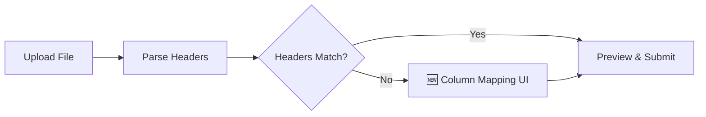

# Smart Field Recognition for Corporate Portal Batch Upload

## Problem

When corporate clients upload CSV/XLSX files via the **Batch Upload** tab in the Service Request page, the system currently **hard-fails** if column headers don't exactly match the expected template fields (`corporateJobNumber`, `deviceBrand`, `model`, etc.). In practice, clients often use their own naming conventions (e.g. `Job No.`, `Brand`, `Serial #`, `Defect Description`). The system should intelligently recognize and auto-map these columns instead of throwing an error.

## Current Architecture

| Layer | File | Current Behavior |
|-------|------|-----------------|
| **Client parsing** | [service-request.tsx](file:///d:/PromiseIntegratedSystem/PromiseIntegratedSystem/client/src/pages/corporate/service-request.tsx) | PapaParse reads CSV headers → `bulkSchema.parse()` fails if names don't match → rows rejected |
| **Client API** | [api.ts](file:///d:/PromiseIntegratedSystem/PromiseIntegratedSystem/client/src/lib/api.ts#L507-L524) | `BulkRow` interface with strict field names |
| **Server validation** | [corporate-portal.routes.ts](file:///d:/PromiseIntegratedSystem/PromiseIntegratedSystem/server/routes/corporate-portal.routes.ts#L32-L43) | `bulkRowSchema` with identical strict names |

## Proposed Changes

The solution adds a **Column Mapping Step** between file upload and validation. This is a **client-side only** change — the server already accepts properly structured rows.



---

### Smart Mapping Engine (Client-Side Utility)

#### [NEW] [columnMapper.ts](file:///d:/PromiseIntegratedSystem/PromiseIntegratedSystem/client/src/lib/columnMapper.ts)

A pure utility module that auto-aligns uploaded column headers to system-required fields.

**Core logic:**
1. **Exact match** — If the uploaded header matches a system field name exactly (case-insensitive), map it automatically.
2. **Alias dictionary** — A pre-built dictionary of known synonyms per field:
   | System Field | Known Aliases |
   |---|---|
   | `corporateJobNumber` | `job no`, `job number`, `job #`, `job id`, `corporate job`, `ref`, `reference`, `ref no` |
   | `deviceBrand` | `brand`, `make`, `manufacturer`, `device brand`, `brand name` |
   | `model` | `model name`, `model number`, `model no`, `device model`, `product`, `device` |
   | `serialNumber` | `serial`, `serial no`, `serial #`, `s/n`, `sn`, `serial number`, `imei` |
   | `reportedDefect` | `defect`, `issue`, `problem`, `fault`, `reported issue`, `complaint`, `description`, `defect description` |
   | `initialStatus` | `status`, `initial status`, `condition`, `ok/ng`, `ok ng` |
   | `physicalCondition` | `physical`, `physical state`, `body condition`, `cosmetic`, `appearance` |
   | `accessories` | `accessory`, `included accessories`, `items`, `included items` |
   | `notes` | `note`, `remarks`, `comment`, `comments`, `additional info` |

3. **Fuzzy similarity** — For remaining unmatched headers, compute a normalized similarity score (Levenshtein + token overlap) and suggest the best match if score > 0.6.
4. Return a `MappingResult` with `autoMapped`, `suggested`, and `unmapped` columns.

**Exports:**
```typescript
interface FieldMapping {
  sourceColumn: string;      // column name from uploaded file
  targetField: string | null; // system field name or null if unmapped
  confidence: 'exact' | 'alias' | 'fuzzy' | 'manual' | 'unmapped';
}

interface MappingResult {
  mappings: FieldMapping[];
  allRequiredMapped: boolean; // true if all 6 required fields are mapped
}

function autoMapColumns(uploadedHeaders: string[], requiredFields: FieldDefinition[]): MappingResult;
function applyMapping(rows: Record<string, string>[], mappings: FieldMapping[]): BulkRow[];
```

---

### Column Mapping UI Component

#### [NEW] [ColumnMappingDialog.tsx](file:///d:/PromiseIntegratedSystem/PromiseIntegratedSystem/client/src/components/corporate/ColumnMappingDialog.tsx)

A full-screen overlay / dialog shown when uploaded headers don't perfectly match. Design:

- **Left column**: System required fields (with required/optional badges)
- **Right column**: Dropdown selectors populated with the uploaded file's headers
- **Auto-filled** where the mapper found matches (green check marks)
- **Yellow warning** for fuzzy matches (editable)
- **Red empty** for unmapped required fields
- **"Apply Mapping" button** enabled only when all required fields are mapped
- Premium visual design matching existing corporate portal aesthetics (rounded cards, slate colors, blue accents)

---

### Modifications to Batch Upload Flow

#### [MODIFY] [service-request.tsx](file:///d:/PromiseIntegratedSystem/PromiseIntegratedSystem/client/src/pages/corporate/service-request.tsx)

**Changes:**

1. **New state variables:**
   - `rawRows: Record<string, string>[]` — raw parsed data before mapping
   - `uploadedHeaders: string[]` — headers extracted from file
   - `showMappingDialog: boolean`
   - `columnMappings: FieldMapping[]`

2. **Modified `handleFileParse` flow:**
   ```
   Parse file → Extract headers → Run autoMapColumns()
   ├── All required fields mapped? → Apply mapping → Set parsedRows → Show preview
   └── Missing required mappings? → Show ColumnMappingDialog
   ```

3. **After mapping dialog confirms:** Apply the user-corrected mappings, transform raw rows to `BulkRow[]`, run `bulkSchema` validation, then show the existing preview table.

4. **Template download** — Keep the existing CSV template as-is (it's the ideal format).

5. **Add XLSX parsing support on client-side** — Currently only CSV is parsed client-side via PapaParse. Add SheetJS (`xlsx` package) for client-side XLSX parsing to support the `.xlsx` format properly (the server already has this but the client preview relies only on PapaParse).

---

### No Server-Side Changes Needed

The server at [corporate-portal.routes.ts](file:///d:/PromiseIntegratedSystem/PromiseIntegratedSystem/server/routes/corporate-portal.routes.ts) already handles both CSV and XLSX and applies its own `bulkRowSchema` validation. Since the mapping happens **before** submission and the client sends a properly structured file, no server changes are required.

> [!IMPORTANT]
> The current `handleBulkSubmit` creates an empty `File` object and sends it to the server, but the actual parsed data from the client-side preview is not being sent to the server. This is a **pre-existing bug** that we should also fix — we should send the mapped `parsedRows` as JSON rather than an empty file, or send the original file with a mapping configuration so the server can apply it. I recommend adding a new API endpoint that accepts JSON rows directly.

---

## User Review Required

> [!WARNING]
> **Pre-existing bug:** The current `handleBulkSubmit` creates an empty `new File([''], 'temp.csv')` and sends it to the server. The server receives an empty file, meaning none of the client-side parsed data actually gets submitted. I will fix this as part of the implementation by sending the parsed (and now properly mapped) rows as JSON to the server.

> [!IMPORTANT]
> **XLSX client-side parsing:** The `xlsx` npm package is already installed (the server uses it as `XLSX`). I'll use the same package on the client side to parse `.xlsx` files in the browser.

## Summary of New/Modified Files

| Action | File | Purpose |
|--------|------|---------|
| **NEW** | `client/src/lib/columnMapper.ts` | Alias dictionary + fuzzy matching engine |
| **NEW** | `client/src/components/corporate/ColumnMappingDialog.tsx` | Interactive mapping UI |
| **MODIFY** | `client/src/pages/corporate/service-request.tsx` | Integrate mapping step into upload flow |
| **MODIFY** | `client/src/lib/api.ts` | Add `bulkServiceRequestsJson` endpoint for JSON-based submission |
| **MODIFY** | `server/routes/corporate-portal.routes.ts` | Add JSON-based bulk endpoint alongside existing file upload |

## Verification Plan

### Manual Verification (Browser Testing)

1. **Navigate** to the Corporate Portal → Service Request → Batch Upload tab
2. **Test 1 — Perfect template**: Upload a CSV with exact header names → should skip mapping dialog, go straight to preview
3. **Test 2 — Aliased headers**: Upload a CSV with headers like `Job No., Brand, Model, Serial #, Issue, Status` → should auto-map all fields (alias match), skip dialog, show preview
4. **Test 3 — Partial mismatch**: Upload a CSV where some headers match and some don't → should show the Column Mapping Dialog with auto-filled and empty fields
5. **Test 4 — XLSX format**: Upload an `.xlsx` file with non-standard headers → should parse correctly and show mapping dialog
6. **Test 5 — Actually submit**: After mapping, click "Proceed with Upload" → verify jobs are created on the dashboard

> [!TIP]
> For manual testing, I'll create sample CSV files with various header naming conventions to verify each scenario.
