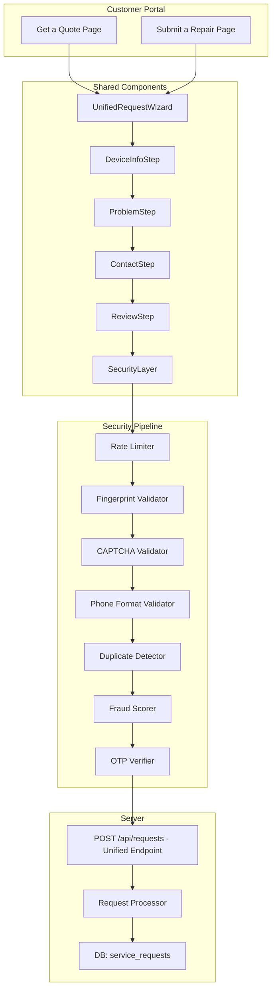
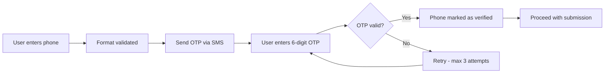
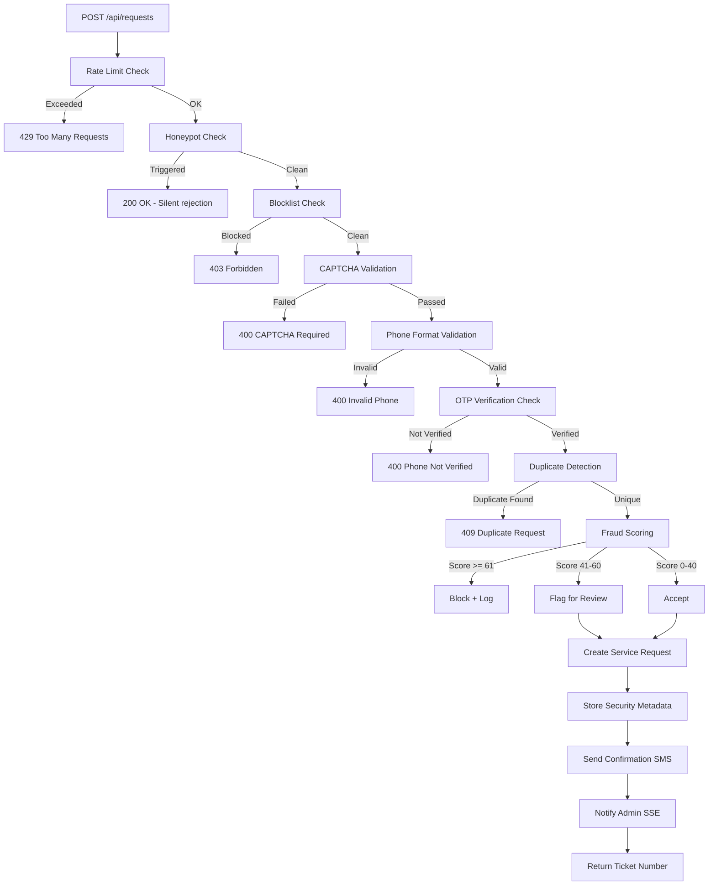

# Unified Request System - Anti-Fraud & Security Architecture Plan

## Executive Summary

The "Get a Quote" and "Submit a Repair" features in the customer portal currently share the same database table (`service_requests`) but have completely separate frontend pages, different API endpoints, inconsistent validation, and **critical unprotected server routes**. This plan designs a **Unified Request System** that eliminates duplication, closes all security holes, and implements a multi-layered anti-fraud defense.

---

## 1. Current State Analysis

### 1.1 How They Work Today

| Aspect | Get a Quote | Submit a Repair |
|--------|-------------|-----------------|
| **Frontend** | `get-quote.tsx` - 3-step wizard | `repair-request.tsx` - 5-step wizard |
| **API Endpoint** | `POST /api/quotes` | `POST /api/service-requests` |
| **Rate Limiting** | ❌ **NONE** | ✅ 10/hour/IP |
| **Auth Required** | ❌ No | ❌ No |
| **DB Table** | `service_requests` with `isQuote=true` | `service_requests` with `isQuote=false` |
| **Schema Validation** | `insertQuoteRequestSchema` | `insertServiceRequestSchema` |
| **Media Upload** | ❌ No | ✅ ImageKit |
| **Account Creation** | ❌ No inline creation | ✅ Creates account inline |
| **Phone Verification** | ❌ None | ❌ None |
| **Bot Protection** | ❌ None | ❌ None |
| **Duplicate Detection** | ❌ None | ❌ None |

### 1.2 Critical Security Vulnerabilities Found

```
🔴 CRITICAL - These need immediate fixing
```

| # | Vulnerability | Location | Impact |
|---|--------------|----------|--------|
| 1 | **No auth on DELETE** | `DELETE /api/service-requests/:id` | Anyone can delete any service request |
| 2 | **No auth on PATCH** | `PATCH /api/service-requests/:id` | Anyone can modify any service request |
| 3 | **No auth on GET all** | `GET /api/service-requests` | Anyone can list all service requests with customer PII |
| 4 | **No auth on GET by ID** | `GET /api/service-requests/:id` | Anyone can fetch any request details |
| 5 | **No rate limit on quotes** | `POST /api/quotes` | Unlimited spam submissions |
| 6 | **No phone verification** | Both forms | Fake numbers, impersonation |
| 7 | **No CAPTCHA/bot protection** | Both forms | Automated bot attacks |
| 8 | **No CSRF tokens** | Public POST endpoints | Cross-site request forgery |
| 9 | **No input sanitization** | Both forms | XSS via description/address fields |
| 10 | **Unvalidated phone formats** | Both forms | Invalid/international numbers accepted |

---

## 2. Unified System Architecture

### 2.1 Core Principle: Single Entry Point, Two Intents

Instead of two separate pages and API routes, we create ONE unified request system with two **intents** - `quote` and `repair`. The frontend can still have two pages for UX clarity, but they share the same components, validation, API, and security layers.



### 2.2 Shared Component Architecture

```
client/src/components/request/
├── UnifiedRequestWizard.tsx      # Main wizard orchestrator
├── steps/
│   ├── DeviceInfoStep.tsx        # Brand, model, screen size
│   ├── ProblemDescriptionStep.tsx # Issue, symptoms, description, media
│   ├── ContactInfoStep.tsx       # Name, phone, address, service preference
│   ├── ReviewAndConfirmStep.tsx   # Summary + terms acceptance
│   └── SuccessStep.tsx           # Confirmation with ticket
├── security/
│   ├── CaptchaWidget.tsx         # Turnstile/hCaptcha wrapper
│   ├── OtpVerification.tsx       # Phone OTP verification modal
│   ├── FingerprintCollector.tsx   # Browser fingerprint collector
│   └── HoneypotFields.tsx        # Hidden bot trap fields
├── hooks/
│   ├── useRequestForm.ts         # Shared form state management
│   ├── useRequestValidation.ts   # Step-by-step validation
│   └── useAntifraud.ts           # Client-side anti-fraud signals
└── types.ts                      # Shared TypeScript types
```

---

## 3. Multi-Layer Anti-Fraud Defense System

### Layer 1: Client-Side Bot Detection

**Honeypot Fields** - Hidden form fields that bots fill but humans don't.

```
- Add invisible fields: email2, website, fax_number
- If any honeypot field has a value, silently reject
- No error message given - bot thinks submission succeeded
```

**Browser Fingerprinting** - Collect device signals to identify unique visitors.

```
Signals collected:
- Canvas fingerprint hash
- WebGL renderer
- Screen resolution + color depth
- Timezone + language
- Installed fonts subset
- Navigator properties
- Touch capability
- Connection type
```

**Behavioral Analysis** - Track how the user interacts with the form.

```
Tracked signals:
- Time spent on each step (bots are instant)
- Mouse movement patterns (bots have none)
- Keystroke timing (bots type instantly)
- Scroll patterns
- Tab focus/blur events
- Total form completion time
```

### Layer 2: CAPTCHA Protection

Use **Cloudflare Turnstile** - free, privacy-friendly, invisible mode.

```
Trigger conditions:
- Always on for unauthenticated users
- Skip for authenticated customers with verified phones
- Escalate to interactive challenge on suspicious signals
```

### Layer 3: Phone Number Validation & OTP

**Bangladesh Phone Format Validation:**
```
Valid patterns: 01[3-9]XXXXXXXX
Operators: Grameenphone 017, Robi 016/018, Banglalink 019/014, Teletalk 015, Airtel 013
Total digits: 11 (with leading 0) or 13 (with +880)
```

**OTP Verification Flow:**


```
OTP Rules:
- 6-digit numeric code
- Expires in 5 minutes
- Max 3 verification attempts per code
- Max 5 OTP requests per phone per hour
- Cooldown: 60 seconds between OTP sends
- Store OTP hash (not plaintext) in DB/Redis
```

### Layer 4: Server-Side Rate Limiting

| Endpoint | Limit | Window | Key |
|----------|-------|--------|-----|
| `POST /api/requests` | 5 | 1 hour | IP |
| `POST /api/requests` | 3 | 1 hour | Phone number |
| `POST /api/otp/send` | 5 | 1 hour | Phone number |
| `POST /api/otp/verify` | 10 | 15 min | IP |
| `GET /api/service-requests` | Admin only | - | Session |
| `PATCH /api/service-requests/:id` | Admin only | - | Session |
| `DELETE /api/service-requests/:id` | Admin only | - | Session |

### Layer 5: Fraud Scoring Engine

Each submission gets a **fraud score** (0-100). Scores above threshold trigger different actions.

```
Scoring Factors:
+30 - Honeypot field filled
+25 - Form completed in < 10 seconds
+20 - No mouse/touch events detected
+15 - Known VPN/proxy IP (via IP reputation API)
+15 - Phone number previously flagged as fraud
+10 - Duplicate submission within 24 hours
+10 - Failed CAPTCHA then passed (bot retry pattern)
+10 - No browser fingerprint (headless browser)
+ 5 - Unusual timezone vs phone country code
+ 5 - Same IP submitted 3+ requests today

Actions by Score:
0-20:  ✅ Accept immediately
21-40: ⚠️ Accept but flag for manual review
41-60: 🔒 Require OTP + interactive CAPTCHA
61+:   ❌ Block submission, log for investigation
```

### Layer 6: Duplicate Detection

Before creating a new request, check:

```
Duplicate Rules:
1. Same phone + same brand + same issue within 48 hours = DUPLICATE
2. Same phone + any request within 2 hours = RATE_LIMITED  
3. Same fingerprint + same issue within 24 hours = SUSPICIOUS
4. Same IP + 3+ different phones in 1 hour = FRAUD_RING
```

### Layer 7: Data Integrity & Tamper Protection

**Request Signing:**
```
Each submission includes a computed integrity hash:
hash = HMAC-SHA256(
  key: server_secret,
  data: JSON.stringify({
    formStartTimestamp,
    fingerprint,
    captchaToken,
    phone,
    brand,
    issue,
    stepTimings[]
  })
)

Server validates this hash before processing.
If hash is missing or invalid -> reject.
```

---

## 4. Database Schema Changes

### 4.1 New `request_security_metadata` Table

```sql
CREATE TABLE request_security_metadata (
  id TEXT PRIMARY KEY,
  service_request_id TEXT NOT NULL REFERENCES service_requests(id),
  
  -- Fingerprinting
  browser_fingerprint TEXT,
  ip_address TEXT NOT NULL,
  user_agent TEXT,
  
  -- Anti-fraud signals
  fraud_score INTEGER DEFAULT 0,
  fraud_flags JSONB DEFAULT '[]',
  form_start_time TIMESTAMP,
  form_submit_time TIMESTAMP,
  time_on_form_seconds INTEGER,
  mouse_events_count INTEGER DEFAULT 0,
  keystroke_count INTEGER DEFAULT 0,
  
  -- Verification status
  captcha_verified BOOLEAN DEFAULT FALSE,
  captcha_provider TEXT,
  phone_otp_verified BOOLEAN DEFAULT FALSE,
  otp_verified_at TIMESTAMP,
  
  -- Honeypot
  honeypot_triggered BOOLEAN DEFAULT FALSE,
  
  -- Request integrity
  integrity_hash TEXT,
  
  created_at TIMESTAMP DEFAULT NOW()
);
```

### 4.2 New `otp_codes` Table

```sql
CREATE TABLE otp_codes (
  id TEXT PRIMARY KEY,
  phone TEXT NOT NULL,
  code_hash TEXT NOT NULL,
  purpose TEXT NOT NULL DEFAULT 'request_verification',
  attempts INTEGER DEFAULT 0,
  max_attempts INTEGER DEFAULT 3,
  expires_at TIMESTAMP NOT NULL,
  verified_at TIMESTAMP,
  ip_address TEXT,
  created_at TIMESTAMP DEFAULT NOW()
);
```

### 4.3 New `fraud_blocklist` Table

```sql
CREATE TABLE fraud_blocklist (
  id TEXT PRIMARY KEY,
  type TEXT NOT NULL, -- 'phone', 'ip', 'fingerprint'
  value TEXT NOT NULL,
  reason TEXT,
  blocked_by TEXT, -- admin user ID
  blocked_at TIMESTAMP DEFAULT NOW(),
  expires_at TIMESTAMP -- null = permanent
);
```

### 4.4 Additions to Existing `service_requests` Table

```sql
ALTER TABLE service_requests ADD COLUMN phone_verified BOOLEAN DEFAULT FALSE;
ALTER TABLE service_requests ADD COLUMN submission_source TEXT DEFAULT 'web'; -- 'web', 'mobile', 'admin'
ALTER TABLE service_requests ADD COLUMN fraud_score INTEGER DEFAULT 0;
ALTER TABLE service_requests ADD COLUMN flagged_for_review BOOLEAN DEFAULT FALSE;
```

---

## 5. API Redesign

### 5.1 New Unified Endpoint

```
POST /api/requests
```

This replaces both `POST /api/quotes` and `POST /api/service-requests` for public submissions.

**Request Body:**
```json
{
  "intent": "quote" | "repair",
  "device": {
    "brand": "Samsung",
    "screenSize": "55 Inch",
    "modelNumber": "UA55AU7700"
  },
  "problem": {
    "serviceType": "LED TV Repair",
    "primaryIssue": "No Display",
    "symptoms": ["Lines on Screen", "Dim Picture"],
    "description": "Screen goes black after 5 minutes"
  },
  "contact": {
    "name": "John Doe",
    "phone": "+8801712345678",
    "address": "House 12, Road 5, Dhanmondi, Dhaka",
    "servicePreference": "home_pickup"
  },
  "media": [
    { "url": "...", "fileId": "...", "resourceType": "image" }
  ],
  "security": {
    "captchaToken": "cf-turnstile-token-here",
    "otpSessionId": "otp-session-uuid",
    "fingerprint": "browser-fingerprint-hash",
    "formStartedAt": "2026-02-06T10:00:00Z",
    "mouseEvents": 142,
    "keystrokeCount": 87,
    "integrityHash": "hmac-sha256-hash"
  },
  "honeypot": {
    "email2": "",
    "website": "",
    "fax": ""
  }
}
```

### 5.2 Secure Existing Endpoints

```
# These become admin-only:
GET    /api/service-requests          → requireAdminAuth
GET    /api/service-requests/:id      → requireAdminAuth OR requireOwnership
PATCH  /api/service-requests/:id      → requireAdminAuth
DELETE /api/service-requests/:id      → requireAdminAuth + requirePermission

# New public tracking endpoint (limited info):
GET    /api/track/:ticketNumber       → Public but rate-limited, returns only safe fields

# OTP endpoints:
POST   /api/otp/send                  → Rate limited: 5/hour/phone
POST   /api/otp/verify                → Rate limited: 10/15min/IP
```

### 5.3 Server Processing Pipeline



---

## 6. Frontend Unified Component Design

### 6.1 Shared Wizard Steps

Both "Get a Quote" and "Submit a Repair" use the same wizard but with configurable steps:

| Step | Get a Quote | Submit a Repair |
|------|-------------|-----------------|
| 1. Device Info | ✅ Brand, Size, Model | ✅ Brand, Size, Model |
| 2. Problem | ✅ Service Type, Issue | ✅ Issue, Symptoms, Description, Media |
| 3. Contact | ✅ Name, Phone+OTP, Preference | ✅ Name, Phone+OTP, Address, Preference |
| 4. Review | ✅ Summary + CAPTCHA + Terms | ✅ Summary + CAPTCHA + Terms |
| 5. Account | ❌ Skip | ✅ Create account if not logged in |
| 6. Success | ✅ Ticket + Next steps | ✅ Ticket + Next steps |

### 6.2 Config-Driven Wizard

```typescript
interface WizardConfig {
  intent: 'quote' | 'repair';
  steps: StepConfig[];
  requiredFields: string[];
  showMediaUpload: boolean;
  showSymptomPicker: boolean;
  showAccountCreation: boolean;
  requireOtp: boolean;
  requireCaptcha: boolean;
}

const QUOTE_CONFIG: WizardConfig = {
  intent: 'quote',
  steps: ['device', 'problem', 'contact', 'review', 'success'],
  requiredFields: ['brand', 'primaryIssue', 'name', 'phone', 'servicePreference'],
  showMediaUpload: false,
  showSymptomPicker: false,
  showAccountCreation: false,
  requireOtp: true,
  requireCaptcha: true,
};

const REPAIR_CONFIG: WizardConfig = {
  intent: 'repair',
  steps: ['device', 'problem', 'contact', 'review', 'account', 'success'],
  requiredFields: ['brand', 'screenSize', 'primaryIssue', 'name', 'phone', 'servicePreference'],
  showMediaUpload: true,
  showSymptomPicker: true,
  showAccountCreation: true,
  requireOtp: true,
  requireCaptcha: true,
};
```

---

## 7. Implementation Phases

### Phase 1: Critical Security Fixes (URGENT)

1. Add `requireAdminAuth` to `GET /api/service-requests`
2. Add `requireAdminAuth` to `GET /api/service-requests/:id`
3. Add `requireAdminAuth` to `PATCH /api/service-requests/:id`
4. Add `requireAdminAuth` + `requirePermission('canDelete')` to `DELETE /api/service-requests/:id`
5. Add rate limiter to `POST /api/quotes`
6. Add input sanitization (DOMPurify) to all text fields server-side
7. Create safe public tracking endpoint `GET /api/track/:ticketNumber`

### Phase 2: Phone Verification (OTP System)

8. Create `otp_codes` table + migration
9. Implement OTP generation service (6-digit, 5-min expiry)
10. Integrate SMS provider (e.g., Twilio, BulkSMS BD, or SSL Wireless)
11. Create `POST /api/otp/send` endpoint with rate limiting
12. Create `POST /api/otp/verify` endpoint
13. Build `OtpVerification` React component
14. Add phone_verified field to service_requests schema

### Phase 3: CAPTCHA Integration

15. Set up Cloudflare Turnstile account
16. Create `CaptchaWidget` React component
17. Add server-side Turnstile token validation
18. Integrate into submission pipeline

### Phase 4: Anti-Fraud Engine

19. Create `request_security_metadata` table + migration
20. Create `fraud_blocklist` table + migration
21. Build `FraudScoringService` on server
22. Implement honeypot field detection
23. Implement browser fingerprint collection (client-side)
24. Implement behavioral signal collection (mouse/keystroke/timing)
25. Build duplicate detection logic
26. Add fraud score to service request records
27. Create admin fraud review dashboard panel

### Phase 5: Unified Frontend

28. Create shared `types.ts` for unified request types
29. Build `useRequestForm` hook (shared form state)
30. Build `useRequestValidation` hook (shared validation)
31. Build `useAntifraud` hook (client-side signal collection)
32. Build `DeviceInfoStep` shared component
33. Build `ProblemDescriptionStep` shared component
34. Build `ContactInfoStep` shared component (with OTP)
35. Build `ReviewAndConfirmStep` shared component (with CAPTCHA)
36. Build `SuccessStep` shared component
37. Build `UnifiedRequestWizard` orchestrator
38. Refactor `get-quote.tsx` to use UnifiedRequestWizard with QUOTE_CONFIG
39. Refactor `repair-request.tsx` to use UnifiedRequestWizard with REPAIR_CONFIG

### Phase 6: Unified API

40. Create `POST /api/requests` unified endpoint with full pipeline
41. Deprecate `POST /api/quotes` (redirect internally)
42. Update `POST /api/service-requests` to use shared pipeline
43. Implement request signing (integrity hash)
44. Add server-side sanitization middleware

### Phase 7: Monitoring & Alerting

45. Add fraud attempt logging to audit trail
46. Create admin notification for high-fraud-score submissions
47. Build fraud analytics dashboard widget
48. Set up alerting for unusual submission patterns

---

## 8. Technology Choices

| Need | Recommended Solution | Why |
|------|---------------------|-----|
| CAPTCHA | Cloudflare Turnstile | Free, invisible mode, privacy-friendly |
| OTP SMS | SMS.net.bd | Bangladesh-focused, reliable. **API:** `https://api.sms.net.bd/sendsms` |
| Fingerprinting | @fingerprintjs/fingerprintjs | Open-source, no API key needed for basic |
| Input Sanitization | DOMPurify (server-side via jsdom) | Industry standard XSS prevention |
| Rate Limiting | express-rate-limit (already used) | Already in codebase, extend it |
| Fraud Scoring | Custom in-house | Simple scoring logic, no external dependency |
| Request Hashing | Node.js crypto (HMAC-SHA256) | Built-in, no dependency |

### 8.1 SMS API Configuration (SMS.net.bd)

```
API Endpoint: https://api.sms.net.bd/sendsms
API Key: Stored in .env as SMS_API_KEY
Method: POST
Content-Type: application/json

Request Body:
{
  "api_key": "<SMS_API_KEY>",
  "msg": "Your Promise Electronics verification code is: 123456. Valid for 5 minutes.",
  "to": "8801712345678"  // Bangladesh format without +
}

Response:
{
  "error": 0,           // 0 = success
  "msg_id": "abc123"    // Message ID for tracking
}
```

**Environment Variables:**
```
SMS_API_URL=https://api.sms.net.bd/sendsms
SMS_API_KEY=<your-api-key>
```

---

## 9. What Changes for End Users

### For Legitimate Customers:
- **First time:** Enter phone → receive OTP → verify → submit (adds ~30 seconds)
- **Returning customers (logged in):** Phone already verified, skip OTP, skip CAPTCHA
- **Same clean wizard experience** - just with invisible security running behind the scenes
- **Faster duplicate feedback** - "You already submitted this request 2 hours ago"

### For Fraudsters/Bots:
- Honeypot traps catch simple bots instantly
- CAPTCHA blocks automated submissions
- OTP verification prevents fake phone numbers
- Fraud scoring catches sophisticated attacks
- Rate limiting prevents spam floods
- Duplicate detection prevents request inflation
- Blocklist prevents repeat offenders

---

## 10. Risk Assessment

| Risk | Mitigation |
|------|-----------|
| SMS OTP costs money | Use OTP only for unverified users; verified users skip it. Budget ~$0.01/SMS |
| No CAPTCHA (Turnstile skipped) | **Use strict honeypot + rate limits**. Bots usually fall for honeypots. |
| False positives in fraud scoring | Start with conservative thresholds, tune based on data. Flag but don't block |
| User friction from OTP | Only required once per phone number. Subsequent requests from same verified phone skip OTP |
| Fingerprint library blocked by ad blockers | Graceful fallback - missing fingerprint adds +10 to fraud score but doesn't block |
