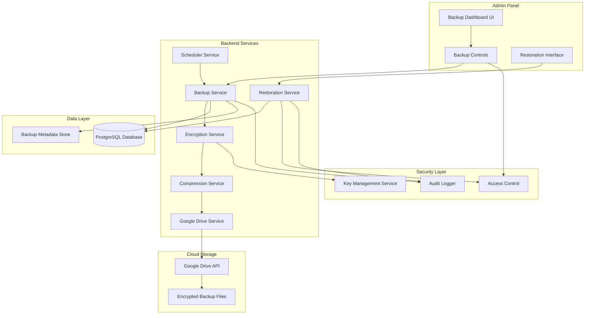
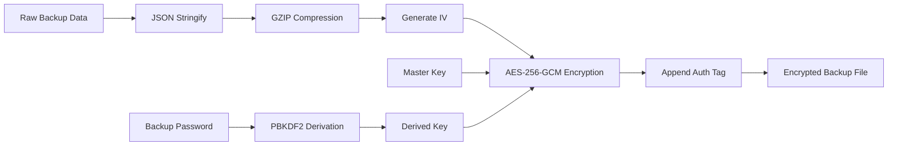
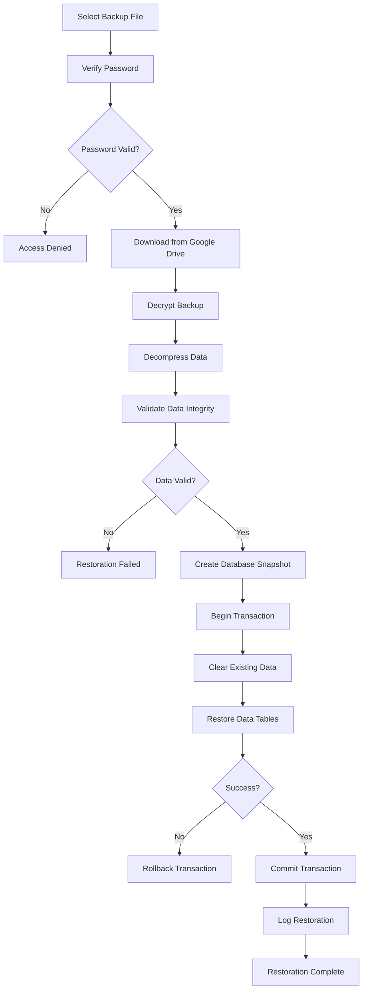

# Universal Backup System - Comprehensive Implementation Plan

> **Project:** Promise Integrated System  
> **Feature:** Universal Database Backup with Encrypted Cloud Storage  
> **Created:** February 12, 2026  
> **Status:** Planning Phase

---

## 📋 Table of Contents

1. [Executive Summary](#executive-summary)
2. [System Analysis](#system-analysis)
3. [Architecture Overview](#architecture-overview)
4. [Backup Data Scope](#backup-data-scope)
5. [Encryption Strategy](#encryption-strategy)
6. [Cloud Storage Integration](#cloud-storage-integration)
7. [Backup Scheduling & Automation](#backup-scheduling--automation)
8. [Restoration Mechanism](#restoration-mechanism)
9. [Admin Panel UI/UX](#admin-panel-uiux)
10. [Security & Access Control](#security--access-control)
11. [Implementation Roadmap](#implementation-roadmap)
12. [Technical Specifications](#technical-specifications)
13. [Risk Mitigation](#risk-mitigation)

---

## 🎯 Executive Summary

### Objective
Create a comprehensive, secure, and automated backup system for the Promise Integrated System that:
- Backs up all database records (customers, transactions, jobs, inventory, etc.)
- Encrypts data with AES-256-GCM encryption
- Stores backups in Google Drive with automatic synchronization
- Provides password-protected access with system-only decryption capability
- Enables scheduled automatic backups and manual on-demand backups
- Supports full database restoration from encrypted backups

### Key Features
- **Complete Data Coverage**: All 26+ database tables
- **Military-Grade Encryption**: AES-256-GCM with unique encryption keys
- **Cloud Integration**: Google Drive API for reliable storage
- **Automated Scheduling**: Daily, weekly, monthly backup options
- **Version Control**: Maintain multiple backup versions with retention policies
- **Secure Restoration**: Password-protected restoration with audit logging
- **Admin Dashboard**: Intuitive UI for backup management

---

## 🔍 System Analysis

### Current Database Structure

Based on the system analysis, the Promise Integrated System uses:

**Database**: PostgreSQL 15+ (Neon Cloud)  
**ORM**: Drizzle ORM 0.39.1  
**Total Tables**: 26+ tables

#### Critical Data Tables

| Category | Tables | Priority |
|----------|--------|----------|
| **Users & Auth** | users, user_sessions, deviceTokens | Critical |
| **Business Core** | jobTickets, serviceRequests, serviceRequestEvents | Critical |
| **Inventory** | inventoryItems, products, productVariants | Critical |
| **Financial** | posTransactions, orders, orderItems, pettyCashRecords, dueRecords, challans | Critical |
| **Customer Data** | customerAddresses, customerReviews, inquiries, warranties, refunds | High |
| **Operations** | attendanceRecords, notifications, pickupSchedules | High |
| **Configuration** | settings, policies, serviceCatalog, serviceCategories | Medium |
| **Corporate** | corporateClients, corporateJobs, corporateMessages, corporateNotifications | High |

### Current Storage Infrastructure

- **Primary Database**: Neon PostgreSQL (Cloud)
- **File Storage**: Google Cloud Storage + Cloudinary CDN
- **Session Store**: PostgreSQL (connect-pg-simple)

---

## 🏗️ Architecture Overview

### System Architecture Diagram



### Component Breakdown

#### 1. Backup Service (`server/services/backup.service.ts`)
- Orchestrates the entire backup process
- Extracts data from all database tables
- **Uses `REPEATABLE READ` transaction isolation** to ensure a consistent data snapshot across all tables
- Manages backup metadata and versioning
- Handles backup lifecycle (create, list, delete)

#### 2. Encryption Service (`server/services/encryption.service.ts`)
- AES-256-GCM encryption/decryption
- Secure key generation and management
- Password-based key derivation (PBKDF2)
- Initialization vector (IV) generation

#### 3. Compression Service (`server/services/compression.service.ts`)
- GZIP compression for backup files
- Reduces storage size by 70-90%
- Maintains data integrity

#### 4. Google Drive Service (`server/services/google-drive.service.ts`)
- OAuth 2.0 authentication
- File upload/download operations
- Folder management
- Backup file organization

#### 5. Restoration Service (`server/services/restoration.service.ts`)
- Secure backup restoration
- **Validates `systemVersion` compatibility** to prevent schema mismatches
- Data validation and integrity checks
- Transaction-based restoration (all-or-nothing)
- Rollback capability

#### 6. Scheduler Service (`server/services/backup-scheduler.service.ts`)
- Cron-based scheduling
- Automatic backup execution
- Retention policy enforcement
- Notification on completion/failure

---

## 📦 Backup Data Scope

### Complete Backup Structure

```typescript
interface BackupData {
  metadata: {
    version: string;              // Backup format version
    timestamp: string;             // ISO 8601 timestamp
    systemVersion: string;         // Application version
    databaseVersion: string;       // PostgreSQL version
    totalRecords: number;          // Total record count
    tables: string[];              // List of backed up tables
    checksum: string;              // SHA-256 checksum
  };
  
  data: {
    // User & Authentication
    users: User[];
    userSessions: UserSession[];
    deviceTokens: DeviceToken[];
    
    // Business Core
    jobTickets: JobTicket[];
    serviceRequests: ServiceRequest[];
    serviceRequestEvents: ServiceRequestEvent[];
    
    // Inventory & Products
    inventoryItems: InventoryItem[];
    products: Product[];
    productVariants: ProductVariant[];
    
    // Financial Records
    posTransactions: PosTransaction[];
    orders: Order[];
    orderItems: OrderItem[];
    pettyCashRecords: PettyCashRecord[];
    dueRecords: DueRecord[];
    challans: Challan[];
    
    // Customer Data
    customerAddresses: CustomerAddress[];
    customerReviews: CustomerReview[];
    inquiries: Inquiry[];
    warranties: Warranty[];
    refunds: Refund[];
    
    // Operations
    attendanceRecords: AttendanceRecord[];
    notifications: Notification[];
    pickupSchedules: PickupSchedule[];
    
    // Configuration
    settings: Setting[];
    policies: Policy[];
    serviceCatalog: ServiceCatalog[];
    serviceCategories: ServiceCategory[];
    
    // Corporate
    corporateClients: CorporateClient[];
    corporateJobs: CorporateJob[];
    corporateMessages: CorporateMessage[];
    corporateNotifications: CorporateNotification[];
    
    // Additional Tables
    spareParts: SparePart[];
    lensOrders: LensOrder[];
    approvals: Approval[];
    auditLogs: AuditLog[];
  };
}
```

### Backup File Naming Convention

```
backup_YYYY-MM-DD_HH-mm-ss_[TYPE]_[CHECKSUM].enc
```

Examples:
- `backup_2026-02-12_14-30-00_manual_a3f5c9d2.enc`
- `backup_2026-02-12_00-00-00_scheduled_b7e2f1a8.enc`

---

## 🔐 Encryption Strategy

### Multi-Layer Security Approach

#### Layer 1: Master Encryption Key
- **Algorithm**: AES-256-GCM (Galois/Counter Mode)
- **Key Size**: 256 bits
- **Storage**: Environment variable + Hardware Security Module (HSM) option
- **Rotation**: Quarterly key rotation with re-encryption

#### Layer 2: Password Protection
- **Algorithm**: PBKDF2 (Password-Based Key Derivation Function 2)
- **Iterations**: 100,000 iterations
- **Salt**: Unique 32-byte random salt per backup
- **Purpose**: Additional layer for restoration authentication

#### Layer 3: Initialization Vector (IV)
- **Size**: 12 bytes (96 bits) for GCM mode
- **Generation**: Cryptographically secure random generation
- **Uniqueness**: New IV for each backup

### Encryption Process Flow



### Key Management

```typescript
interface EncryptionKeys {
  masterKey: string;           // Stored in environment
  backupPassword: string;      // User-provided during backup
  derivedKey: Buffer;          // Derived from password
  iv: Buffer;                  // Random IV per backup
  authTag: Buffer;             // GCM authentication tag
}

interface BackupMetadata {
  encryptionVersion: string;   // "AES-256-GCM-v1"
  salt: string;                // Base64 encoded salt
  iv: string;                  // Base64 encoded IV
  authTag: string;             // Base64 encoded auth tag
  iterations: number;          // PBKDF2 iterations
}
```

### Security Features

1. **Authentication Tag**: GCM mode provides built-in authentication
2. **Tamper Detection**: Any modification invalidates the auth tag
3. **No Key Storage**: Backup password never stored, only used during operations
4. **System-Only Decryption**: Requires both master key (environment) and user password
5. **Audit Trail**: All encryption/decryption operations logged

---

## ☁️ Cloud Storage Integration

### Google Drive API Integration

#### Authentication Strategy

**OAuth 2.0 Service Account** (Recommended for automated backups)

```typescript
interface GoogleDriveConfig {
  clientEmail: string;         // Service account email
  privateKey: string;          // Service account private key
  scopes: string[];            // ['https://www.googleapis.com/auth/drive.file']
  backupFolderId: string;      // Dedicated backup folder ID
}
```

#### Folder Structure

```
Promise Backups/
├── 2026/
│   ├── 02-February/
│   │   ├── daily/
│   │   │   ├── backup_2026-02-12_00-00-00_scheduled_a3f5c9d2.enc
│   │   │   ├── backup_2026-02-13_00-00-00_scheduled_b7e2f1a8.enc
│   │   │   └── ...
│   │   ├── weekly/
│   │   │   └── backup_2026-02-11_00-00-00_weekly_c9d3e5f7.enc
│   │   └── monthly/
│   │       └── backup_2026-02-01_00-00-00_monthly_d1f4a6b8.enc
│   └── ...
└── metadata/
    └── backup_index.json
```

#### Google Drive Service Implementation

```typescript
class GoogleDriveBackupService {
  private drive: drive_v3.Drive;
  
  async uploadBackup(
    filePath: string,
    metadata: BackupMetadata
  ): Promise<string>;
  
  async downloadBackup(fileId: string): Promise<Buffer>;
  
  async listBackups(
    startDate?: Date,
    endDate?: Date
  ): Promise<BackupFile[]>;
  
  async deleteBackup(fileId: string): Promise<void>;
  
  async verifyBackupIntegrity(fileId: string): Promise<boolean>;
}
```

#### Alternative: Dual Storage Strategy

For maximum reliability, implement dual storage:

1. **Primary**: Google Drive (user-controlled)
2. **Secondary**: Google Cloud Storage (system bucket)

```typescript
interface StorageStrategy {
  primary: 'google-drive';
  secondary: 'google-cloud-storage';
  syncBoth: boolean;           // Upload to both simultaneously
  fallback: boolean;           // Use secondary if primary fails
}
```

### Storage Optimization

- **Compression**: GZIP reduces size by 70-90%
- **Deduplication**: Track checksums to avoid duplicate backups
- **Incremental Backups**: Future enhancement for large databases
- **Retention Policy**: Automatic cleanup of old backups

---

## ⏰ Backup Scheduling & Automation

### Scheduling Options

#### 1. Automated Schedules

```typescript
interface BackupSchedule {
  id: string;
  name: string;
  type: 'daily' | 'weekly' | 'monthly' | 'custom';
  enabled: boolean;
  cronExpression: string;
  retentionDays: number;
  notifyOnSuccess: boolean;
  notifyOnFailure: boolean;
  lastRun?: Date;
  nextRun?: Date;
}
```

**Predefined Schedules**:

| Type | Cron Expression | Description | Retention |
|------|----------------|-------------|-----------|
| Daily | `0 0 * * *` | Every day at midnight | 7 days |
| Weekly | `0 0 * * 0` | Every Sunday at midnight | 30 days |
| Monthly | `0 0 1 * *` | 1st of each month at midnight | 365 days |
| Custom | User-defined | Flexible scheduling | User-defined |

#### 2. Manual Backups

- On-demand backup creation
- Immediate execution
- Custom retention period
- Optional description/notes

### Scheduler Implementation

```typescript
class BackupScheduler {
  private jobs: Map<string, CronJob>;
  
  async scheduleBackup(schedule: BackupSchedule): Promise<void>;
  async cancelSchedule(scheduleId: string): Promise<void>;
  async executeBackup(scheduleId: string): Promise<BackupResult>;
  async getNextRunTime(scheduleId: string): Promise<Date>;
}
```

### Retention Policy

```typescript
interface RetentionPolicy {
  daily: {
    keep: number;              // Keep last 7 daily backups
    deleteAfterDays: number;   // Delete after 7 days
  };
  weekly: {
    keep: number;              // Keep last 4 weekly backups
    deleteAfterDays: number;   // Delete after 30 days
  };
  monthly: {
    keep: number;              // Keep last 12 monthly backups
    deleteAfterDays: number;   // Delete after 365 days
  };
  manual: {
    keep: number;              // Keep last 10 manual backups
    deleteAfterDays: number;   // Delete after 90 days
  };
}
```

### Notification System

```typescript
interface BackupNotification {
  type: 'success' | 'failure' | 'warning';
  scheduleId: string;
  timestamp: Date;
  message: string;
  details?: {
    fileSize: number;
    duration: number;
    recordCount: number;
    error?: string;
  };
}
```

**Notification Channels**:
- In-app notifications (admin panel)
- Email notifications (optional)
- Push notifications to admin devices
- Webhook integration (optional)

---

## 🔄 Restoration Mechanism

### Restoration Process Flow



### Restoration Service

```typescript
class RestorationService {
  async restoreFromBackup(
    backupId: string,
    password: string,
    options: RestorationOptions
  ): Promise<RestorationResult>;
  
  async validateBackup(
    backupId: string,
    password: string
  ): Promise<ValidationResult>;
  
  async previewBackup(
    backupId: string,
    password: string
  ): Promise<BackupPreview>;
  
  async createDatabaseSnapshot(): Promise<string>;
  
  async rollbackToSnapshot(snapshotId: string): Promise<void>;
}

interface RestorationOptions {
  createSnapshot: boolean;     // Create DB snapshot before restore
  selectiveTables?: string[];  // Restore only specific tables
  mergeMode: boolean;          // Merge with existing data vs replace
  skipValidation: boolean;     // Skip data validation (not recommended)
}

interface RestorationResult {
  success: boolean;
  duration: number;
  tablesRestored: string[];
  recordsRestored: number;
  errors?: string[];
  snapshotId?: string;
}
```

### Safety Mechanisms

1. **Pre-Restoration Snapshot**: Automatic database snapshot before restoration
2. **Transaction-Based**: All-or-nothing restoration using database transactions
3. **Validation Checks**: Verify data integrity and foreign key constraints
4. **Rollback Capability**: Revert to pre-restoration state if issues occur
5. **Audit Logging**: Complete audit trail of restoration operations

### Selective Restoration

Allow administrators to restore specific tables or data categories:

```typescript
interface SelectiveRestoration {
  categories: {
    users: boolean;
    financial: boolean;
    inventory: boolean;
    jobs: boolean;
    customers: boolean;
    settings: boolean;
  };
  customTables?: string[];
}
```

---

## 🎨 Admin Panel UI/UX

### Backup Management Dashboard

#### Main Dashboard Layout

```
┌─────────────────────────────────────────────────────────────┐
│  🔒 Backup & Restore                                        │
├─────────────────────────────────────────────────────────────┤
│                                                              │
│  ┌──────────────┐  ┌──────────────┐  ┌──────────────┐      │
│  │ Total Backups│  │ Last Backup  │  │ Storage Used │      │
│  │     24       │  │  2 hours ago │  │   1.2 GB     │      │
│  └──────────────┘  └──────────────┘  └──────────────┘      │
│                                                              │
│  ┌─────────────────────────────────────────────────────┐   │
│  │ Quick Actions                                        │   │
│  │  [Create Backup Now]  [Restore from Backup]         │   │
│  │  [Schedule Settings]  [View Backup History]         │   │
│  └─────────────────────────────────────────────────────┘   │
│                                                              │
│  ┌─────────────────────────────────────────────────────┐   │
│  │ Scheduled Backups                                    │   │
│  │  ✓ Daily Backup      - Next: Today 12:00 AM         │   │
│  │  ✓ Weekly Backup     - Next: Sunday 12:00 AM        │   │
│  │  ✓ Monthly Backup    - Next: March 1, 12:00 AM      │   │
│  └─────────────────────────────────────────────────────┘   │
│                                                              │
│  ┌─────────────────────────────────────────────────────┐   │
│  │ Recent Backups                                       │   │
│  │  📦 backup_2026-02-12_14-30-00  [Download] [Restore]│   │
│  │  📦 backup_2026-02-12_00-00-00  [Download] [Restore]│   │
│  │  📦 backup_2026-02-11_00-00-00  [Download] [Restore]│   │
│  └─────────────────────────────────────────────────────┘   │
└─────────────────────────────────────────────────────────────┘
```

#### Create Backup Dialog

```typescript
interface CreateBackupDialog {
  fields: {
    backupName: string;        // Optional custom name
    description: string;       // Optional description
    password: string;          // Required encryption password
    confirmPassword: string;   // Password confirmation
    includeFiles: boolean;     // Include uploaded files (future)
  };
  
  actions: {
    create: () => Promise<void>;
    cancel: () => void;
  };
}
```

#### Restore Backup Dialog

```typescript
interface RestoreBackupDialog {
  steps: [
    {
      title: "Select Backup";
      component: BackupSelector;
    },
    {
      title: "Enter Password";
      component: PasswordInput;
    },
    {
      title: "Preview Data";
      component: BackupPreview;
    },
    {
      title: "Confirm Restoration";
      component: ConfirmationStep;
    },
    {
      title: "Restoration Progress";
      component: ProgressIndicator;
    }
  ];
}
```

#### Backup History Table

| Date | Type | Size | Records | Status | Actions |
|------|------|------|---------|--------|---------|
| 2026-02-12 14:30 | Manual | 45 MB | 12,543 | ✓ Success | Download, Restore, Delete |
| 2026-02-12 00:00 | Scheduled | 44 MB | 12,489 | ✓ Success | Download, Restore, Delete |
| 2026-02-11 00:00 | Scheduled | 43 MB | 12,401 | ✓ Success | Download, Restore, Delete |

### UI Components

#### 1. Backup Card Component

```tsx
<BackupCard
  backup={backup}
  onDownload={() => handleDownload(backup.id)}
  onRestore={() => handleRestore(backup.id)}
  onDelete={() => handleDelete(backup.id)}
  onVerify={() => handleVerify(backup.id)}
/>
```

#### 2. Schedule Manager Component

```tsx
<ScheduleManager
  schedules={schedules}
  onCreateSchedule={handleCreateSchedule}
  onEditSchedule={handleEditSchedule}
  onToggleSchedule={handleToggleSchedule}
  onDeleteSchedule={handleDeleteSchedule}
/>
```

#### 3. Restoration Wizard Component

```tsx
<RestorationWizard
  backups={availableBackups}
  onComplete={handleRestorationComplete}
  onCancel={handleCancel}
/>
```

### User Experience Features

- **Progress Indicators**: Real-time progress for backup/restore operations
- **Confirmation Dialogs**: Prevent accidental deletions or restorations
- **Validation Feedback**: Immediate feedback on password strength, file integrity
- **Tooltips & Help**: Contextual help for complex operations
- **Responsive Design**: Mobile-friendly interface for on-the-go management

---

## 🛡️ Security & Access Control

### Access Control Matrix

| Role | Create Backup | Restore Backup | Delete Backup | View Backups | Manage Schedules |
|------|--------------|----------------|---------------|--------------|------------------|
| Super Admin | ✓ | ✓ | ✓ | ✓ | ✓ |
| Manager | ✓ | ✗ | ✗ | ✓ | ✓ |
| Technician | ✗ | ✗ | ✗ | ✗ | ✗ |
| Cashier | ✗ | ✗ | ✗ | ✗ | ✗ |

### Permission System

```typescript
interface BackupPermissions {
  canCreateBackup: boolean;
  canRestoreBackup: boolean;
  canDeleteBackup: boolean;
  canViewBackups: boolean;
  canManageSchedules: boolean;
  canDownloadBackups: boolean;
  canConfigureEncryption: boolean;
}

// Permission check middleware
async function requireBackupPermission(
  permission: keyof BackupPermissions
) {
  return async (req: Request, res: Response, next: NextFunction) => {
    const user = req.session.adminUser;
    if (!user || !hasBackupPermission(user, permission)) {
      return res.status(403).json({ error: 'Insufficient permissions' });
    }
    next();
  };
}
```

### Audit Logging

```typescript
interface BackupAuditLog {
  id: string;
  timestamp: Date;
  userId: string;
  userName: string;
  action: 'create' | 'restore' | 'delete' | 'download' | 'verify';
  backupId: string;
  backupName: string;
  ipAddress: string;
  userAgent: string;
  success: boolean;
  errorMessage?: string;
  metadata?: {
    fileSize?: number;
    duration?: number;
    recordCount?: number;
  };
}
```

**Audit Log Features**:
- Immutable log entries
- Searchable and filterable
- Export to CSV/PDF
- Real-time monitoring dashboard
- Anomaly detection (unusual patterns)

### Security Best Practices

1. **Password Requirements**:
   - Minimum 12 characters
   - Mix of uppercase, lowercase, numbers, symbols
   - Not same as user password
   - Password strength indicator

2. **Rate Limiting**:
   - Max 3 backup creations per hour
   - Max 5 restoration attempts per day
   - Exponential backoff on failed password attempts

3. **IP Whitelisting** (Optional):
   - Restrict backup operations to specific IP ranges
   - Configurable in settings

4. **Two-Factor Authentication** (Future):
   - Require 2FA for restoration operations
   - SMS or authenticator app verification

5. **Encryption Key Rotation**:
   - Quarterly master key rotation
   - Automatic re-encryption of recent backups
   - Notification to administrators

---

## 🗺️ Implementation Roadmap

### Phase 1: Foundation (Week 1-2)

#### Backend Infrastructure

- [ ] Create backup service architecture
- [ ] Implement encryption service with AES-256-GCM
- [ ] Implement compression service with GZIP
- [ ] Create backup metadata schema in database
- [ ] Set up Google Drive API integration
- [ ] Implement basic backup creation functionality

**Deliverables**:
- `server/services/backup.service.ts`
- `server/services/encryption.service.ts`
- `server/services/compression.service.ts`
- `server/services/google-drive.service.ts`
- Database migration for backup metadata table

### Phase 2: Core Functionality (Week 3-4)

#### Backup & Restoration

- [ ] Complete backup data extraction for all tables
- [ ] Implement backup upload to Google Drive
- [ ] Create restoration service
- [ ] Implement data validation and integrity checks
- [ ] Add transaction-based restoration
- [ ] Create database snapshot functionality

**Deliverables**:
- `server/services/restoration.service.ts`
- Complete backup/restore API endpoints
- Unit tests for core services

### Phase 3: Automation & Scheduling (Week 5)

#### Scheduler Implementation

- [ ] Implement backup scheduler service
- [ ] Create cron job management
- [ ] Implement retention policy enforcement
- [ ] Add notification system for backup events
- [ ] Create backup cleanup service

**Deliverables**:
- `server/services/backup-scheduler.service.ts`
- Automated backup execution
- Retention policy implementation

### Phase 4: Admin Panel UI (Week 6-7)

#### Frontend Development

- [ ] Create backup management dashboard
- [ ] Implement backup creation dialog
- [ ] Create restoration wizard
- [ ] Build schedule management interface
- [ ] Add backup history table
- [ ] Implement progress indicators

**Deliverables**:
- `client/src/pages/admin/backup-restore.tsx`
- `client/src/components/backup/*`
- Responsive UI components

### Phase 5: Security & Access Control (Week 8)

#### Security Implementation

- [ ] Implement role-based access control
- [ ] Add audit logging system
- [ ] Create password validation
- [ ] Implement rate limiting
- [ ] Add encryption key management
- [ ] Security testing and penetration testing

**Deliverables**:
- Complete access control system
- Audit log dashboard
- Security documentation

### Phase 6: Testing & Optimization (Week 9-10)

#### Quality Assurance

- [ ] Unit testing (90%+ coverage)
- [ ] Integration testing
- [ ] End-to-end testing
- [ ] Performance optimization
- [ ] Load testing (large database backups)
- [ ] Security audit

**Deliverables**:
- Comprehensive test suite
- Performance benchmarks
- Security audit report

### Phase 7: Documentation & Deployment (Week 11-12)

#### Finalization

- [ ] User documentation
- [ ] Admin guide
- [ ] API documentation
- [ ] Deployment guide
- [ ] Training materials
- [ ] Production deployment

**Deliverables**:
- Complete documentation
- Deployment scripts
- Training videos
- Production-ready system

---

## 🔧 Technical Specifications

### Technology Stack

#### Backend

| Component | Technology | Version | Purpose |
|-----------|-----------|---------|---------|
| Runtime | Node.js | 20.x+ | Server runtime |
| Language | TypeScript | 5.6.3 | Type safety |
| Database | PostgreSQL | 15+ | Data storage |
| ORM | Drizzle ORM | 0.39.1 | Database operations |
| Encryption | Node.js Crypto | Built-in | AES-256-GCM encryption |
| Compression | zlib | Built-in | GZIP compression |
| Scheduler | node-cron | 3.0.3 | Backup scheduling |
| Cloud Storage | Google Drive API | v3 | Backup storage |
| Authentication | Google Auth Library | 10.5.0 | OAuth 2.0 |

#### Frontend

| Component | Technology | Version | Purpose |
|-----------|-----------|---------|---------|
| Framework | React | 19.2.0 | UI framework |
| State Management | TanStack Query | 5.60.5 | Server state |
| UI Components | Radix UI | Various | Headless components |
| Styling | TailwindCSS | 4.1.14 | Styling |
| Forms | React Hook Form | 7.66.0 | Form management |
| Validation | Zod | 3.25.76 | Schema validation |

### Database Schema

#### Backup Metadata Table

```typescript
export const backupMetadata = pgTable("backup_metadata", {
  id: text("id").primaryKey(),
  fileName: text("file_name").notNull(),
  fileSize: integer("file_size").notNull(),
  googleDriveFileId: text("google_drive_file_id").notNull(),
  
  // Backup Information
  backupType: text("backup_type").notNull(), // 'manual' | 'scheduled'
  scheduleId: text("schedule_id"),
  description: text("description"),
  
  // Encryption Metadata
  encryptionVersion: text("encryption_version").notNull(),
  salt: text("salt").notNull(),
  iv: text("iv").notNull(),
  authTag: text("auth_tag").notNull(),
  iterations: integer("iterations").notNull(),
  
  // Data Metadata
  totalRecords: integer("total_records").notNull(),
  tablesIncluded: jsonb("tables_included").notNull(),
  checksum: text("checksum").notNull(),
  
  // System Information
  systemVersion: text("system_version").notNull(),
  databaseVersion: text("database_version").notNull(),
  
  // Timestamps
  createdAt: timestamp("created_at").notNull().defaultNow(),
  createdBy: text("created_by").notNull(),
  expiresAt: timestamp("expires_at"),
  
  // Status
  status: text("status").notNull().default("active"), // 'active' | 'expired' | 'deleted'
  verified: boolean("verified").default(false),
  lastVerifiedAt: timestamp("last_verified_at"),
});

export const backupSchedules = pgTable("backup_schedules", {
  id: text("id").primaryKey(),
  name: text("name").notNull(),
  type: text("type").notNull(), // 'daily' | 'weekly' | 'monthly' | 'custom'
  cronExpression: text("cron_expression").notNull(),
  enabled: boolean("enabled").notNull().default(true),
  retentionDays: integer("retention_days").notNull(),
  notifyOnSuccess: boolean("notify_on_success").default(true),
  notifyOnFailure: boolean("notify_on_failure").default(true),
  lastRun: timestamp("last_run"),
  nextRun: timestamp("next_run"),
  createdAt: timestamp("created_at").notNull().defaultNow(),
  updatedAt: timestamp("updated_at").notNull().defaultNow(),
});

export const backupAuditLogs = pgTable("backup_audit_logs", {
  id: text("id").primaryKey(),
  timestamp: timestamp("timestamp").notNull().defaultNow(),
  userId: text("user_id").notNull(),
  userName: text("user_name").notNull(),
  action: text("action").notNull(),
  backupId: text("backup_id"),
  backupName: text("backup_name"),
  ipAddress: text("ip_address"),
  userAgent: text("user_agent"),
  success: boolean("success").notNull(),
  errorMessage: text("error_message"),
  metadata: jsonb("metadata"),
});
```

### API Endpoints

#### Backup Management

```typescript
// Create manual backup
POST /api/admin/backups
Body: {
  password: string;
  description?: string;
  name?: string;
}
Response: {
  backupId: string;
  fileName: string;
  fileSize: number;
  recordCount: number;
}

// List all backups
GET /api/admin/backups
Query: {
  page?: number;
  limit?: number;
  type?: 'manual' | 'scheduled';
  startDate?: string;
  endDate?: string;
}
Response: {
  backups: BackupMetadata[];
  total: number;
  page: number;
  limit: number;
}

// Get backup details
GET /api/admin/backups/:id
Response: BackupMetadata

// Download backup
GET /api/admin/backups/:id/download
Headers: {
  Authorization: Bearer <token>
}
Response: Binary file stream

// Delete backup
DELETE /api/admin/backups/:id
Response: { success: boolean }

// Verify backup integrity
POST /api/admin/backups/:id/verify
Body: { password: string }
Response: {
  valid: boolean;
  checksum: string;
  recordCount: number;
}
```

#### Restoration

```typescript
// Preview backup contents
POST /api/admin/backups/:id/preview
Body: { password: string }
Response: {
  metadata: BackupMetadata;
  tables: string[];
  recordCounts: Record<string, number>;
}

// Restore from backup
POST /api/admin/backups/:id/restore
Body: {
  password: string;
  createSnapshot: boolean;
  selectiveTables?: string[];
  mergeMode: boolean;
}
Response: {
  success: boolean;
  duration: number;
  tablesRestored: string[];
  recordsRestored: number;
  snapshotId?: string;
}
```

#### Scheduling

```typescript
// Create schedule
POST /api/admin/backup-schedules
Body: BackupSchedule
Response: BackupSchedule

// List schedules
GET /api/admin/backup-schedules
Response: BackupSchedule[]

// Update schedule
PATCH /api/admin/backup-schedules/:id
Body: Partial<BackupSchedule>
Response: BackupSchedule

// Delete schedule
DELETE /api/admin/backup-schedules/:id
Response: { success: boolean }

// Execute schedule manually
POST /api/admin/backup-schedules/:id/execute
Response: { backupId: string }
```

### Environment Variables

```bash
# Backup Configuration
BACKUP_MASTER_KEY=<256-bit-hex-key>
BACKUP_ENCRYPTION_ALGORITHM=aes-256-gcm
BACKUP_PBKDF2_ITERATIONS=100000

# Google Drive Configuration
GOOGLE_DRIVE_CLIENT_EMAIL=<service-account-email>
GOOGLE_DRIVE_PRIVATE_KEY=<service-account-private-key>
GOOGLE_DRIVE_BACKUP_FOLDER_ID=<folder-id>

# Backup Settings
BACKUP_MAX_SIZE_MB=500
BACKUP_COMPRESSION_LEVEL=6
BACKUP_DEFAULT_RETENTION_DAYS=30
```

---

## ⚠️ Risk Mitigation

### Identified Risks & Mitigation Strategies

#### 1. Data Loss During Restoration

**Risk**: Restoration failure could corrupt existing data

**Mitigation**:
- Mandatory database snapshot before restoration
- Transaction-based restoration (all-or-nothing)
- Rollback capability
- Validation checks before committing
- Test restoration in staging environment first

#### 2. Encryption Key Loss

**Risk**: Lost master key makes all backups unrecoverable

**Mitigation**:
- Store master key in multiple secure locations
- Key escrow service (optional)
- Regular key backup procedures
- Document key recovery process
- Consider hardware security module (HSM)

#### 3. Google Drive API Quota Limits

**Risk**: API quota exceeded during large backups

**Mitigation**:
- Implement exponential backoff
- Chunked upload for large files
- Monitor quota usage
- Fallback to secondary storage
- Request quota increase if needed

#### 4. Large Database Performance

**Risk**: Backup/restore operations slow down system

**Mitigation**:
- Schedule backups during low-traffic hours
- Implement streaming for large datasets
- Use database connection pooling
- Progress indicators for user feedback
- Optimize queries with indexes

### Goal: Build a streamlined, distraction-free environment for repair technicians and integrate physical workflow bridging (QR codes).

#### 3.1 Interface Refactoring [IMPLEMENTED]
- **Distraction-Free Technician Route:**
  - Introduce a dedicated workspace layout (`/tech`) that skips the global sidebar/navigation.
  - Apply the `Technician` role route partitioning to ensure default landing upon login.
  - Replace complex metrics with three critical operator metrics: Active Repairs, Pending Parts, Completed Today.

#### 5. Unauthorized Access

**Risk**: Unauthorized users accessing backup system

**Mitigation**:
- Role-based access control
- Audit logging of all operations
- Password complexity requirements
- Rate limiting on sensitive operations
- IP whitelisting (optional)
- Two-factor authentication (future)

#### 6. Backup File Corruption

**Risk**: Corrupted backups cannot be restored

**Mitigation**:
- Checksum verification (SHA-256)
- GCM authentication tag
- Regular backup integrity checks
- Multiple backup versions
- Automated verification after creation

#### 7. Storage Costs

**Risk**: Backup storage costs escalate

**Mitigation**:
- GZIP compression (70-90% reduction)
- Retention policy enforcement
- Automatic cleanup of old backups
- Monitor storage usage
- Incremental backups (future enhancement)

#### 8. Schema Compatibility
                                                                                                    
**Risk**: Restoring a backup into a newer/older database version causes errors
                                                                                                    
**Mitigation**:
- Strict `systemVersion` checking during restoration
- Optional auto-migration of old backup data (advanced)
- Warning prompts if versions differ
- Maintain separate backups for major version upgrades

---

## 📊 Success Metrics

### Key Performance Indicators (KPIs)

1. **Backup Success Rate**: Target 99.9%
2. **Average Backup Duration**: < 5 minutes for typical database
3. **Compression Ratio**: 70-90% size reduction
4. **Restoration Success Rate**: Target 100%
5. **Average Restoration Duration**: < 10 minutes
6. **Storage Efficiency**: < 2GB for 1 year of backups
7. **System Uptime**: 99.9% availability
8. **Security Incidents**: Zero unauthorized access

### Monitoring Dashboard

Track and display:
- Total backups created
- Storage usage trends
- Backup success/failure rates
- Average backup size
- Restoration history
- Schedule execution status
- Audit log summary

---

## 🎓 User Training & Documentation

### Documentation Deliverables

1. **Admin User Guide**
   - How to create manual backups
   - How to schedule automated backups
   - How to restore from backups
   - Best practices and recommendations

2. **Technical Documentation**
   - Architecture overview
   - API reference
   - Database schema
   - Encryption specifications

3. **Security Guide**
   - Password management
   - Access control configuration
   - Audit log review
   - Incident response procedures

4. **Troubleshooting Guide**
   - Common issues and solutions
   - Error message reference
   - Recovery procedures
   - Support contact information

### Training Materials

- Video tutorials for common operations
- Interactive walkthrough for first-time setup
- FAQ section
- Best practices checklist

---

## 🚀 Future Enhancements

### Phase 2 Features (Post-Launch)

1. **Incremental Backups**
   - Only backup changed data
   - Reduce backup time and storage
   - Faster backup creation

2. **Multi-Cloud Support**
   - Dropbox integration
   - OneDrive integration
   - AWS S3 integration
   - Azure Blob Storage

3. **Advanced Restoration**
   - Point-in-time recovery
   - Selective record restoration
   - Merge strategies (conflict resolution)

4. **Backup Analytics**
   - Backup size trends
   - Data growth analysis
   - Cost optimization recommendations

5. **Automated Testing**
   - Periodic backup restoration tests
   - Automated integrity verification
   - Health check reports

6. **Mobile App Integration**
   - Backup status notifications
   - Remote backup triggering
   - Backup management from mobile

7. **Disaster Recovery**
   - Automated failover
   - Geographic redundancy
   - Business continuity planning

---

## 📝 Conclusion

This comprehensive backup system will provide the Promise Integrated System with:

✅ **Complete Data Protection**: All database records backed up securely  
✅ **Military-Grade Security**: AES-256-GCM encryption with password protection  
✅ **Cloud Integration**: Reliable Google Drive storage  
✅ **Automation**: Scheduled backups with retention policies  
✅ **Easy Restoration**: User-friendly restoration process  
✅ **Audit Trail**: Complete logging of all operations  
✅ **Scalability**: Designed to handle growing data volumes  

The system is designed with security, reliability, and ease of use as top priorities, ensuring that your business data is always protected and recoverable.

---

**Next Steps**: Review this plan, provide feedback, and approve for implementation.
